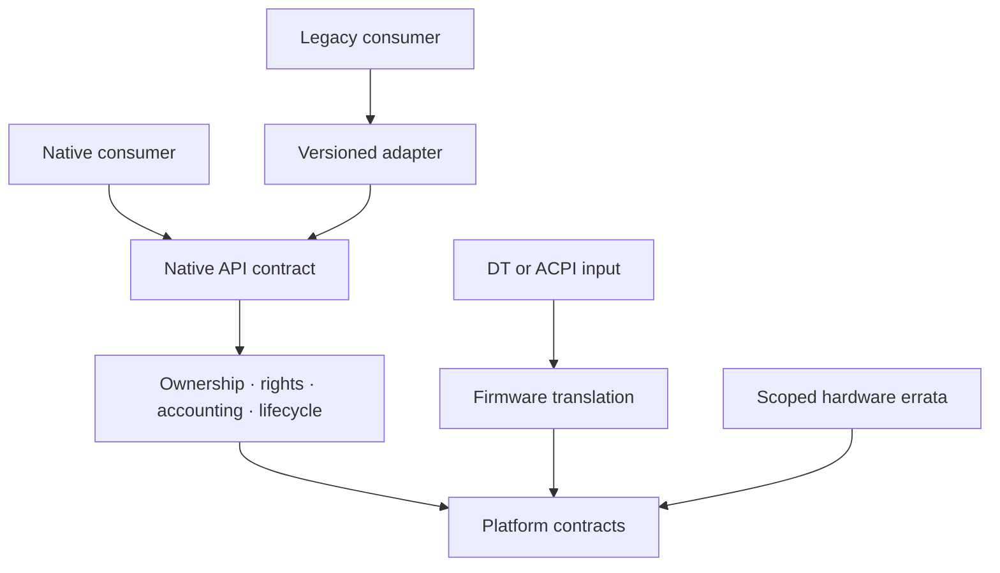

# Native model v0.1

## Границы

Native core отвечает за task/address-space lifecycle, scheduler mechanism, memory
ownership, capability authorization, IPC/wait primitives, resource accounting и
необходимые device abstractions. Размещение VFS, network stack и drivers по protection
domains ещё не выбрано: [ADR-0008](../adr/0008-placement.md). Разделение модулей само
по себе не является доказательством изоляции памяти.

Core импортирует platform interfaces, platform implementations используют AArch64
registers. Core не импортирует compat. Adapter использует только публичный native
contract и не получает ссылки на private MM/scheduler/VFS objects. Будущий dependency
check обязан проверять Cargo graph, generated bindings и feature closure, а не имена папок.

## Объекты и полномочия

Object identity отделена от отображаемых чисел. Handle — проверяемая ссылка с rights,
type и защитой от reuse; конкретное encoding пока не фиксируется как ABI. Copy handle
не добавляет rights. Delegation может только уменьшать полномочия. Revocation policy
должна явно различать прекращение новых operations и уже принятые in-flight requests.

Create возвращает полностью инициализированный объект либо не публикует его вовсе.
State machine: `Constructing -> Live -> Retiring -> Dead`. Upgrade в strong reference
из Retiring/Dead запрещён. Request держит необходимые references до terminal completion.
Close потребляет handle независимо от позднего I/O diagnostic. Cancellation не равна
rollback; результат показывает, произошло ли внешнее действие.

Основание: [pidfd](../../research/pathology/KOL-PATH-0019.json),
[close](../../research/pathology/KOL-PATH-0001.json),
[epoll regression](../../research/pathology/KOL-PATH-0030.json).

## Память и I/O

Native `ReadOnlyPage`, `WritableBuffer`, `DmaLease` обозначают разные ownership contracts,
а не готовые Rust types. Copy-on-write не меняет authorization. Device access держит
pin lease до завершения или подтверждённого reset. Cache coherence не освобождает от
publication barriers. User pointer никогда не становится обычным `&T` без lifetime,
alignment, aliasing, fault и mutation proof; request decoder формирует owned snapshot.

File locks и endpoint ownership имеют один authoritative arbiter для native и compat.
Два adapters не могут независимо обещать exclusive ownership одного shared object.
Zero-copy допускается только с доказанными permissions и lifetime backing pages.
Durability отделена от write acceptance и close; block completion order не обещается.

## Время и ошибки

Внешнее время: signed 64-bit seconds, nanoseconds в диапазоне 0..999999999 и clock
domain; внутреннее представление может отличаться. Deadline overflow возвращает ошибку.
Monotonic clock — default для ожиданий. Перестановка или перевод clock domain не молчаливы.
Unsupported, PermissionDenied, InvalidRequest, ResourceExhausted, Cancelled и I/O failure
различаются; Linux errno mapping принадлежит adapter. Ошибка не может означать fake success.

## ARM64 target contract

Первый platform implementation должен предоставить boot descriptor parsing, EL1 trap
entry/exit, MMU map/unmap/TLB synchronization, CPU startup/shutdown, interrupt tokens,
timer deadline и MMIO/DMA primitives. SMP TLB shootdown и interrupt context являются
частью contract, а не будущей правкой однопроцессорной модели.

QEMU virt — семейство версионированных machine models; нужно закрепить точные QEMU
version, machine, CPU, accelerator, memory, SMP, GICv3 и transports в Phase 0.2.
Адреса устройств обнаруживаются через DT, не предполагаются постоянными. См.
[QEMU virt documentation](https://www.qemu.org/docs/master/system/arm/virt.html).
QEMU tests не доказывают реальные timing, silicon errata, DMA coherency или PMU costs.

Для второго порта core contract suite должен исполняться с mock backend и отдельной
architecture implementation; переносимость нельзя объявить доказанной до такого порта.
