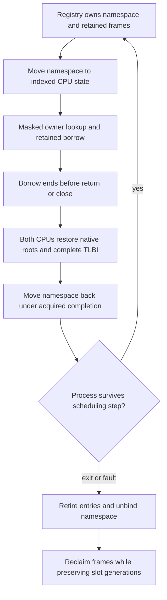

# Process-local handles

Document status: CURRENT
Evidence scope: bounded Phase 3.3 exact-source QEMU verification; two fixed-affinity CPUs, no authority or transfer.
Current reference: [ADR-0019](../architecture-decisions/0019-process-local-handles.md)

## Representation and caller context

[Handle primitives](../../crates/kernel-core/src/handles.rs) encode an opaque LE64 value: eight low slot bits and 56 generation bits. The namespace capacity is eight entries. This is an explicit provisional wire encoding, never a cast of an internal structure. Generation zero is an invalid encoding, not a special resource. Predictable integer identities are not secrets or authority.

Each process slot retains one linear namespace across ProcessId reuse. Binding records the exact ProcessId; lookup checks caller, bounds, generation, live entry and requested kind. Equal numbers in different namespaces can refer to different resources. A foreign number never selects another process table. [Native request handling](../../crates/kernel/src/handles.rs) derives caller context from the scheduler-owned task and bound namespace, verifies the Phase 3.2 executing context, and copies a 32-byte request into an immutable snapshot.

```text
LE64 version=1, operation=(1 lookup | 2 close), handle, kind=(1 event | 2 completion)
safe copy -> decode snapshot -> current namespace -> generation/live/type check
           -> synchronous retained reference -> later independent authority gate
```

Only lookup and close are exposed. Status words are native bounded outcomes: 0 success, 1 invalid encoding/request, 2 stale, 3 wrong type, 4 foreign context, 5 inactive, 6 capacity, 7 generation exhaustion, 8 copy failure. Unknown version/opcode/kind fails. Close also validates the requested kind. No pointer, physical address, global object ID, internal enum layout or compatibility errno crosses EL0. Creation is trusted bootstrap/fixture work, not an unprivileged object-creation authority API.

## Ownership and target lifetime

Each owned target carries an immutable kernel-only TargetId (creating ProcessId, slot and reservation generation), distinct from the process-local wire Handle. Moving a namespace preserves TargetId; reusing its slot creates a different target. TargetId is never serialized to EL0 and grants no authority.

The two concrete targets are the existing coalescing wait Event and an owned immutable process Completion record. The completion retains its value, not a live process or address space. Closing it cannot terminate a process. The event owns its latch storage. This narrow sum is not a universal KernelObject hierarchy or generic invocation interface.

A namespace owns each target directly in bounded initialized storage. Lookup returns a Retained borrow; no allocation or reference count is required. A used retained borrow excludes mutable close/retire at compile time, as checked by a compile-fail test. Accepted work here is synchronous and finishes before close; asynchronous retained requests, shared publishers and delegated references remain unimplemented. Closing removes exactly one resource owner and invalidates future lookup. Double close is Stale. Resource-specific methods are available only to trusted kernel code; a successful EL0 lookup grants no read/write/terminate/delegate authority.



[Process ownership](../../crates/kernel/src/process.rs) retains namespace generations after retirement. [Scheduler integration](../../crates/kernel/src/scheduler/mod.rs) moves each namespace into the owner state through existing publication permits, then moves it back through quiescent editing after both CPU completions. Task metadata remains copied evidence; namespaces and targets are not cloned. No global handle lock, new UnsafeCell, unsafe Sync, raw-pointer cache or unchecked indexing is introduced. Fixed affinity, private mappings and exclusive masked owner sections exclude lookup/close/retirement races. Future migration, shared mappings or asynchronous operations require a new exclusion/retention proof.

DEV reports process slot/generation, capacity, active count, live slot generations/kinds and retiring lifecycle after quiescence. It does not print complete raw handle values, kernel pointers or payloads. PROD removes diagnostics and retains the same checks. Eight inline targets are the deterministic per-process quota; lookup/close do not allocate, block, yield, log or call an external service.

Runqueue preparation initializes existing storage under its exclusive preparing permit. It avoids by-value State copies on the fixed DEV stack. The acceptance audit reproduced BSS corruption from oversized stack temporaries in the previous implementation; in-place preparation removes those copies while preserving report continuity and namespace ownership.

## Generation and transactional publication

```text
reserve vacant slot -> burn generation -> prepare owned resource
 -> publish explicit handle bytes through safe copy -> infallible live commit
close -> remove owned resource -> lookup is stale
reuse same slot -> strictly greater generation
process exit/fault -> retire all entries -> unbind -> preserve counters
next ProcessId generation -> rebind same namespace -> old handle stays stale
```

Generation advances at reservation, including failed publication. Close removes live state immediately; the next allocation advances generation. At 2^56-1 the vacant slot is permanently exhausted. There is no wrap, truncation or automatic namespace reset. Other available slots remain usable; errors distinguish Capacity from GenerationExhausted. A one-slot/two-generation instantiation exercises the identical exhaustion algorithm in host and actual EL0 fixture execution. The limit is not claimed practically impossible.

Creation owns the prepared target on the kernel stack until publication succeeds. Failure drops it and leaves a vacant slot with a burned generation. The callback cannot access the exclusively borrowed namespace. In the current private fixed-affinity process, EL0 cannot execute/read its partially published bytes during the synchronous callback; commit completes before return. Partial copy failure can leave stale bytes in user RAM, but never a live entry. A future shared mapping changes this publication argument and requires redesign.

## Verification and performance gate

[EL0 verification](../../crates/kernel/src/handles/testing.rs) drives forged/stale/wrong-kind lookup and double close through the production copied request path. Two real processes submit the same raw handle: the empty receiver cannot resolve the sender resource. Eight two-CPU creation/exit/fault/reclaim rounds preserve handle generations across reused process slots. Frame counts and namespace emptiness are checked. The fixture also covers live borrowed events, completion ownership, capacity, small-limit generation exhaustion, failed user publication and repeated close/reuse.

Five build controls remove actual generation validation, owner validation, type checking, generation advancement or retirement cleanup. The runner must detect each in DEV and PROD. These mutate enforcement, not test expectations. Retirement requires its dedicated handle-retirement-reject event so unrelated panics cannot count as the expected invariant rejection. The verified matrix includes existing Phase 3.2 and lifecycle controls, native-only removal, routing regression, host tests, Clippy and repository checks.

Five per-CPU scopes retain four warmups and 32 raw timer observations: successful lookup, failed lookup, create, close and slot reuse. Create measures target construction and namespace commit with a no-op publication callback; user-copy/EL0 setup is excluded. Close preparation is outside its interval. Reuse measures create/close/create/close. Measurements are regression baselines under QEMU TCG, not hardware throughput claims. Compiler-observation barriers materialize intermediate namespace states so create/close/reuse cannot be folded away. The measured candidate has 73 source hashes, 72 checks and 67 negative controls.

Recorded timer ticks at 62.5 MHz, 32 samples per cell. Single-operation PROD observations approach timer granularity; a zero median is a quantized observation, not a claim of zero execution cost. Do not infer a hardware speedup from these samples:

| Scope                 | DEV CPU0 median / p95 | DEV CPU1 median / p95 | PROD CPU0 median / p95 | PROD CPU1 median / p95 |
| --------------------- | --------------------- | --------------------- | ---------------------- | ---------------------- |
| handle_lookup_success | 44 / 50               | 50 / 75               | 6 / 7                  | 6 / 13                 |
| handle_lookup_failure | 38 / 50               | 37 / 44               | 6 / 125                | 6 / 7                  |
| handle_create         | 68 / 81               | 69 / 88               | 6 / 31                 | 6 / 13                 |
| handle_close          | 44 / 56               | 44 / 50               | 6 / 31                 | 6 / 63                 |
| handle_slot_reuse     | 206 / 218             | 212 / 225             | 6 / 13                 | 6 / 19                 |

[Kernel receipt](../../research/results/kernel-phase33.json), [native-only receipt](../../research/results/native-compat-removal-phase33.json), [routing regression](../../research/results/routing-phase33-regression.json) and [unsafe inventory](../../research/results/kernel-phase33-unsafe-audit.json) retain the exact measured scope. Native-only compares 59 unchanged native/harness files; production unsafe delta is zero and three linked-fixture sites are test-only. An earlier CI invocation encountered a secondary CPU failure before its ownership negative control; it is not accepted as success or hidden by the runner. Final CI must pass on the published candidate.

## Scope before capabilities

Identity/type/lifetime checks produce a resource reference; they do not authorize effects. Phase 3.4 can add explicit admission checks around the same caller namespace and retained resource without changing handle identity. Rights representation, authority issuer, delegation, revocation and asynchronous accepted-work retention still require their own contracts. Issue #23 includes later rights/transfer acceptance and is not closed by this bounded milestone. Linux fd/Windows HANDLE semantics, IPC, sharing/duplication, security domains, capability bits, magic current/root handles and a universal object model are excluded.

[Russian translation](../../translations/ru/docs/kernel/handles.md)
