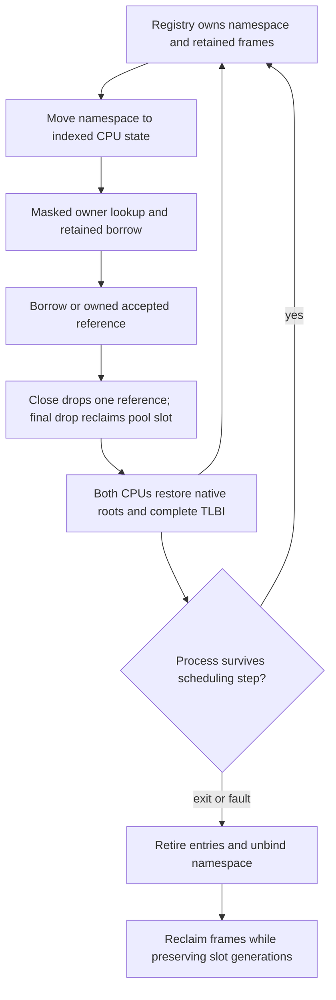

# Process-local handles

Document status: CURRENT
Evidence scope: bounded generation-safe caller-local handles with explicit SEND/TRANSFER/REVOKE rights, attenuated shared targets and target-wide Event admission revocation; two fixed-affinity CPUs.
Current reference: [ADR-0020](../architecture-decisions/0020-handle-transfer-and-retention.md) for handle identity/transfer/lifetime, supplemented by [ADR-0022](../architecture-decisions/0022-native-event-grants-and-revocation.md) for the minimal Event grant/revocation slice.

## Representation and caller context

[Handle primitives](../../crates/kernel-core/src/handles.rs) encode an opaque LE64 value: eight low slot bits and 56 generation bits. The namespace capacity is eight entries. This is an explicit provisional wire encoding, never a cast of an internal structure. Generation zero is an invalid encoding, not a special resource. Predictable integer identities are not secrets or authority.

Each process slot retains one linear namespace across ProcessId reuse. Binding records the exact ProcessId; lookup checks caller, bounds, generation, live entry, requested kind and required rights. Equal numbers in different namespaces can refer to different resources. A wire handle never selects another process table. [Native request handling](../../crates/kernel/src/handles.rs) derives caller context from the scheduler-owned task and bound namespace, verifies the executing context, and copies a 48-byte request into an immutable snapshot before touching namespace entries.

```text
LE64[6] version=1, operation=(1 lookup | 2 close | 3 transfer | 4 revoke)
lookup/close: handle, kind, required_rights, reserved=0
transfer:     handle, receiver_process_slot, receiver_generation, requested_rights
revoke:       handle, reserved=0, reserved=0, reserved=0
safe copy -> decode snapshot -> current caller table -> generation/type/rights check
           -> receiver-local handle with the same target binding
```

Lookup, close, transfer and shared-Event revoke are exposed. Rights are `SEND=1`, `TRANSFER=2` and `REVOKE=4`; unknown bits fail. Bootstrap defaults grant SEND to Events and no rights to Completion records; broader rights require an explicit trusted `create_*_with_rights` grant. Transfer requires TRANSFER and a subset of held rights. Revoke requires REVOKE and atomically prevents later Event signal admissions through every alias. A signal racing revoke is ordered by the target state CAS; work admitted earlier and already-pending notification remain valid. Close drops only one local reference and is not revoke. The receiver is identified by a live ProcessId already bound to a namespace on the caller's CPU; other-CPU requests fail with ForeignProcess. Status words are native bounded outcomes: 0 success, 1 invalid encoding/request, 2 stale, 3 wrong type, 4 foreign context, 5 inactive, 6 capacity, 7 generation exhaustion, 8 copy failure, 9 rights denied, 10 retained-reference quota exhausted. Unknown version/opcode/kind fails. Close validates kind and generation. No pointer, physical address, global object ID, internal enum layout or compatibility errno crosses EL0. Creation remains trusted bootstrap work, not an unprivileged object-creation authority API.

The real EL0 fixture submits the revoke operation through its copied 48-byte request and verifies that a subsequent SEND admission returns `Revoked`. Host controls verify that a delegated alias stays revoked after source close. These controls cover the Event slice; they do not establish the full grant, service-lifecycle or security-domain acceptance for issue #24.

The revoked admission result is wire status 11; existing status values retain their prior meanings.

## Ownership and target lifetime

Each owned target carries an immutable kernel-only TargetId (creating ProcessId, slot and reservation generation), distinct from the process-local wire Handle. Moving a namespace preserves TargetId; reusing its slot creates a different target. TargetId is never serialized to EL0 and grants no authority.

The two concrete targets are the existing coalescing wait Event and an owned immutable process Completion record. The completion retains its value, not a live process or address space. Closing it cannot terminate a process. Delegated Event handles share one atomic latch in a fixed 512-slot kernel pool. Each slot carries a nonwrapping generation and allows at most 1,024 live references. The per-process namespace remains eight entries; exhausted pool or reference quotas fail explicitly. This narrow sum is not a universal KernelObject hierarchy or generic invocation interface.

A namespace owns one reference per entry. Lookup returns a Retained borrow; its `.retain()` operation creates an owned reference for accepted work. A used borrow excludes mutable close/retire at compile time. Transfer validates both tables before publishing a fresh receiver-local generation, attenuates rights, and preserves TargetId. Revoking an Event is target-wide across aliases, while close removes one entry and blocks future lookup through that token; delegated entries and owned retained work keep the target alive. Double close is Stale. Resource-specific methods remain kernel-only; handle rights gate admission but do not add an EL0 object pointer or general invoke interface.



[Process ownership](../../crates/kernel/src/process.rs) retains namespace generations after retirement. [Scheduler integration](../../crates/kernel/src/scheduler/mod.rs) moves each namespace into the owner state through existing publication permits, then moves it back through quiescent editing after both CPU completions. Same-CPU lookups and EL0 transfer use the already exclusive scheduler ownership permit; no table/object lock is acquired. Cross-CPU tests transfer while both namespaces are coordinator-owned, then race source close against recipient lookup on real EL0 CPUs. Atomic reference counts protect the shared Event target. No new UnsafeCell, unsafe Sync, raw-pointer cache or unchecked indexing is introduced. Safe user copy happens before namespace access, and no lock crosses copy, allocation, wait or external calls.

DEV reports process slot/generation, capacity, active count, live slot generations/kinds and retiring lifecycle after quiescence. It does not print complete raw handle values, kernel pointers or payloads. PROD removes diagnostics and retains the same checks. Eight table entries per process, 512 shared Event slots and 1,024 references per target are explicit quotas. Lookup/close/transfer do not allocate, block, yield, log or call an external service.

Runqueue preparation initializes existing storage under its exclusive preparing permit. It avoids by-value State copies on the fixed DEV stack. The acceptance audit reproduced BSS corruption from oversized stack temporaries in the previous implementation; in-place preparation removes those copies while preserving report continuity and namespace ownership.

## Generation and transactional publication

```text
reserve vacant slot -> burn generation -> prepare owned resource
 -> publish explicit handle bytes through safe copy -> infallible live commit
close -> remove owned resource -> lookup is stale
reuse same slot -> strictly greater generation
process exit/fault -> retire all entries -> unbind -> preserve counters
next ProcessId generation -> rebind same namespace -> old handle stays stale
```

Generation advances at reservation, including failed publication. Close removes live state immediately; the next allocation advances generation. At 2^56-1 the vacant slot is permanently exhausted. There is no wrap, truncation or automatic namespace reset. Other available slots remain usable; errors distinguish Capacity from GenerationExhausted. A one-slot/two-generation instantiation exercises the identical exhaustion algorithm in host and actual EL0 fixture execution. The limit is not claimed practically impossible.

Creation owns the prepared target on the kernel stack until publication succeeds. Failure drops it and leaves a vacant slot with a burned generation. The callback cannot access the exclusively borrowed namespace. In the current private fixed-affinity process, EL0 cannot execute/read its partially published bytes during the synchronous callback; commit completes before return. Partial copy failure can leave stale bytes in user RAM, but never a live entry. A future shared mapping changes this publication argument and requires redesign.

## Verification and performance gate

[EL0 verification](../../crates/kernel/src/handles/testing.rs) drives forged/stale/wrong-kind lookup, double close, required-right checks and transfer through the production copied request path. The receiver obtains a different local token for the same TargetId with SEND only; an attempted rights escalation and a full receiver table are rejected transactionally. The source closes before accepted work completes. Two CPUs also receive delegated aliases, then run source close and recipient lookup concurrently on the same atomic Event. Eight two-CPU creation/exit/fault/reclaim rounds preserve handle generations across reused process slots. Frame counts, target identity and namespace cleanup are checked. The fixture also covers completion ownership, capacity, small-limit generation exhaustion, failed user publication and repeated close/reuse.

Six build controls remove actual generation validation, owner validation, type checking, generation advancement, retirement cleanup or transfer rights enforcement. The runner must detect each in DEV and PROD. These mutate enforcement, not test expectations. Retirement requires its dedicated handle-retirement-reject event so unrelated panics cannot count as the expected invariant rejection. The verified matrix includes existing Phase 3.2 and lifecycle controls, native-only removal, routing regression, host tests, Clippy and repository checks.

Five per-CPU scopes retain four warmups and 32 raw timer observations: successful lookup, failed lookup, create, close and slot reuse. Create measures target construction and namespace commit with a no-op publication callback; user-copy/EL0 setup is excluded. Close preparation is outside its interval. Reuse measures create/close/create/close. Measurements are regression baselines under QEMU TCG, not hardware throughput claims. Compiler-observation barriers materialize intermediate namespace states so create/close/reuse cannot be folded away. These numbers are the original Phase 3.3 baseline; the current issue #23 exact-source receipt is recorded separately.

Recorded timer ticks at 62.5 MHz, 32 samples per cell. Single-operation PROD observations approach timer granularity; a zero median is a quantized observation, not a claim of zero execution cost. Do not infer a hardware speedup from these samples:

| Scope                 | DEV CPU0 median / p95 | DEV CPU1 median / p95 | PROD CPU0 median / p95 | PROD CPU1 median / p95 |
| --------------------- | --------------------- | --------------------- | ---------------------- | ---------------------- |
| handle_lookup_success | 44 / 50               | 50 / 75               | 6 / 7                  | 6 / 13                 |
| handle_lookup_failure | 38 / 50               | 37 / 44               | 6 / 125                | 6 / 7                  |
| handle_create         | 68 / 81               | 69 / 88               | 6 / 31                 | 6 / 13                 |
| handle_close          | 44 / 56               | 44 / 50               | 6 / 31                 | 6 / 63                 |
| handle_slot_reuse     | 206 / 218             | 212 / 225             | 6 / 13                 | 6 / 19                 |

[Issue #23 exact-source receipt](../../research/measurements/runs/1791022558822-issue23-transfer-bf3f9b298688.json) records 73 DEV/PROD checks and 69 negative controls. The [original Phase 3.3 baseline](../../research/results/kernel-phase33.json), [native-only receipt](../../research/results/native-compat-removal-phase33.json), [routing regression](../../research/results/routing-phase33-regression.json) and [unsafe inventory](../../research/results/kernel-phase33-unsafe-audit.json) retain their separate scopes. Native-only compares 59 unchanged native/harness files; production unsafe delta is zero and three linked-fixture sites are test-only.

## Scope before capabilities

Identity/type/lifetime checks produce a resource reference; they do not authorize effects. Issue #23 adds SEND/TRANSFER admission, attenuation and bounded owned Event retention. A future phase can add an authority issuer, revocation and broader asynchronous work contracts without changing handle identity. Linux fd/Windows HANDLE semantics, general IPC, unrestricted duplication, security domains, capability bits, magic current/root handles and a universal object model are excluded.

[Russian translation](../../translations/ru/docs/kernel/handles.md)
