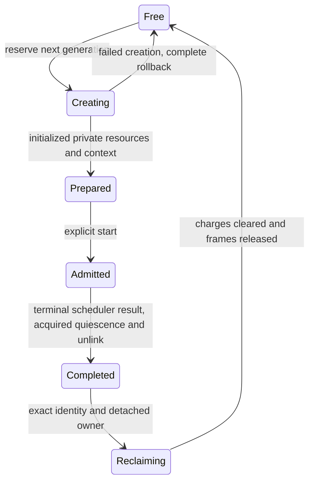
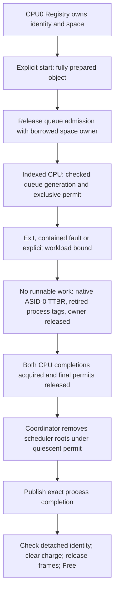

# Dynamic process lifecycle

Document status: CURRENT
Evidence scope: Phase 3.1, bounded two-CPU trusted-bootstrap processes; issue #20.
Current reference: [ADR-0017](../architecture-decisions/0017-process-lifecycle.md)

## Identity and ownership

[ProcessId](../../crates/kernel-core/src/process.rs) contains a private slot and nonzero u64 generation. Reservation increments with checked arithmetic; failed creation burns its identity. Exhausted generations never wrap. Process identity is not authority, a handle or an external ABI. Fixed affinity currently derives from the reserved per-CPU slot range; future migration can move an owner without changing the slot/generation identity format.

One [Registry](../../crates/kernel/src/process.rs) is constructed by kernel_main and retained across workloads. A permanent singleton claim prevents a second registry or generation reset after dropping the first. Rust mutable ownership plus CPU0/IRQ observations protects the table; owned Frames make the registry non-Send/non-Sync. No process-table UnsafeCell or global process lock is added. CPU0 is the existing bootstrap physical allocator/coordinator, not a permanent admission policy for future services. Ordinary EL0 has no create endpoint. Explicit Origin::El0 is denied before reservation; a real unsupported EL0 create SVC faults only its caller.

Registry objects own private table/code/data/guarded-stack allocations through [OwnedUserSpace](../../crates/kernel/src/memory/mod.rs). Persistent charges survive forgotten guards. Admission descriptors borrow those owners rather than passing unretained raw root values. Only the indexed CPU mutates a published scheduler task; IRQ never accesses Registry. Bootstrap chooses trusted image, affinity and optional workload bounds; process identity never grants access to another object.

## State machine

Admitted includes runnable and executing ownership; Ready/Running and terminal frame state are enforced inside the per-CPU scheduler. There is no misleading process-level Running flag updated by a coordinator before CPU execution. Completed is unavailable while any admitted task/root can execute. Repeated start, premature completion/reclaim, duplicate terminal publication and double reclaim fail; inaccessible Free slots reject even their last generation. Reuse cannot retarget stale process, task, report or completion references.

Completion distinguishes Exited(code), Faulted(class,address), BudgetExpired and CreationFailed(step). FAR is included only for architectural abort classes; SVC/sysreg/unknown faults report zero instead of leaking a previous process's undefined FAR value. CreationFailed is returned with the failed attempt identity; it is not a partially live waitable object. Successful completion is a copied kernel-internal observation, repeatable until reclaim. validate_completion checks the live exact identity and terminal reason. This is not the future public wait API.

## Creation transaction

Before reservation, validate bootstrap origin, observed caller/IRQ state, quiescent admission context, owner range, trusted image bounds, entry/stack, AArch64 EL0 PSTATE and nonzero optional slice limit. Five injected boundaries cover Slot, Frames, Space, Context and Commit on both target CPUs.

| Step    | Owned resource                                              | Rollback                                                                    |
| ------- | ----------------------------------------------------------- | --------------------------------------------------------------------------- |
| Slot    | Creating record and consumed generation                     | Return occupancy to Free, never rewind generation                           |
| Frames  | Zeroed contiguous allocation                                | Consume Frame through the authoritative physical pool                       |
| Space   | Private tables, RX image, RW data/stack and retained charge | Clear the unadmitted charge, then return every frame                        |
| Context | Valid initial architectural frame                           | Discard unpublished value and undo previous resources                       |
| Commit  | Prepared object owned by Registry                           | Failure occurs before object insertion/publication; undo previous resources |

No creation step publishes a runnable reference. start changes Prepared to Admitted; dispatch publishes only fully initialized admitted descriptors with release ordering. Capacity is the scheduler's explicit four slots per CPU, independent of fixture count. Exhaustion fails without allocation or overwrite. Image/stack/table resources use one bounded contiguous lease; no fallible heap growth occurs in process creation. The verifier checks physical availability, occupancy and stale failed identities after every injected failure, and subsequently allocates the entire table to expose retained charges.

## Dispatch, completion and reclamation

The [scheduler](scheduler.md) keeps permanent queues and distinct dispatch generations. Empty slots are Vacant and never chosen; secondary-only and empty dispatch are supported. The small Admission descriptor excludes diagnostic report storage, preventing large report arrays from being copied through caller stacks. Full contexts, accounting and routing reports retain their previous semantics. Quiescent editing uses the existing exclusive inspection permit and the same three storage dereference sites.

Dispatch is a synchronous kernel-internal driver over admitted work, not the lifetime of Registry or a boot shutdown operation. It accepts an optional deadline; None imposes no hidden completion deadline. Without a deadline, return depends on admitted programs eventually terminating. Each exit/fault removes runnable execution; participating CPUs return to the native ASID-0 root, locally invalidate each terminal process ASID and publish completion only after barriers. Unsupported-ASID fallback performs full local TLBI on every switch. Scheduler roots are cleared before dispatch returns, so admission borrows can end safely. No Registry borrow is accessed from IRQ. No scope/ordinary lock spans ERET or completion waiting. Reclaim requires Completed, matching identity, no executing owner and acquired detached queues; timeout cannot authorize reclaim.

This first implementation conservatively requires both CPU dispatches to quiesce before reclaim or another admission round. It does not admit new work while an owner executes an existing round, reclaim one process while its peer remains active, or implement blocking/wakeup. Prepared and completed objects persist across dispatches; they are not reset with queue generations. Forgotten Registry/space ownership quarantines resources; dropping a live Registry is a fatal trusted invariant violation, and a new singleton cannot silently reset generations.

## Evidence and profile scope

The Phase 3.1 [kernel results](../../research/results/kernel-phase31.json), [unsafe inventory](../../research/results/kernel-phase31-unsafe-audit.json), [routing regression](../../research/results/routing-phase31-regression.json) and [physical compatibility-source removal evidence](../../research/results/native-compat-removal-phase31.json) retain sources/artifacts and the stated QEMU scope. The removal run confirms the same 65 tests per profile after physically removing the optional compatibility packages; the earlier Phase 3 record remains a separate historical result. Previous 54 tests and 41 failure controls remain. Added real checks cover admission, normal exit/fault, every rollback boundary, capacity, same-slot reuse, stale completion, duplicate start/exit/reclaim, singleton/actual CPU1 rejection, denied create, sparse queues and returned physical resources. Six lifecycle controls run in DEV/PROD: missing unlink, duplicate start/exit, stale identity, premature reclaim and omitted space rollback.

Bounded stress performs 32 rounds with one process on each CPU: 64 create/start/exit-or-fault/reclaim cycles per profile, including sixteen secondary faults and peer survival. Each round checks exact terminal reason, private tag, zero live occupancy and the original free-page count. This is short deterministic QEMU stress, not long-term reliability, fuzzing or silicon weak-memory evidence. DEV emits slot/generation/owner/state and rollback-step traces; stripped PROD omits them. Both use one lifecycle implementation; profile optimization changes no mandatory validation, lifetime or failure outcome.

## ASID lifecycle update (#18)

The current scheduler uses hardware-width-checked, fixed-affinity process ASID leases with a monotonic software epoch. Native root uses ASID zero. Ordinary tagged root switches do not issue TLBI; the owning CPU completes `TLBI ASIDE1` before terminal retirement and tag reuse. Both roots and frames remain retained until scheduler detachment and completion. Unsupported width keeps the full-flush mode. DEV/PROD now run 70 checks, including four-ASID-per-CPU forced exhaustion, changed physical backing at the same user VA, same-VA isolation on both CPUs and frame reclamation. The negative `--asid-reuse-control` omits retirement invalidation and must fail `asid_reuse_requires_invalidation`; QEMU TCG still observes isolation with invalidation omitted. Eight counterbalanced QEMU pairs are retained in [issue18-asid-measurements.json](../../research/results/issue18-asid-measurements.json); they are TCG timer observations, not hardware throughput. See [ADR-0018](../architecture-decisions/0018-asid-lifecycle.md).

## Limits and next gate

No IPC, user-copy, handles, capabilities, domains, ELF loader, migration, work stealing, package runtime or universal kernel object is added. Native dependencies remain kernel/kernel-core; routing policy stays in the optional EL0 image. Old bootstrap fixtures and that image now use the same create/start/dispatch/reclaim mechanism. Native-only builds require the same matrix after physical compatibility-package removal.

Issue #22 can build on exact process identity, privately retained address spaces, explicit admission, terminal isolation, scheduler detachment and nonreusable stale references. It still must implement fault-contained copies, access validation, immutable request snapshots and mutation/race handling; a ProcessId or numerical address is never a user-copy authorization. No public user-pointer API is introduced. Future asynchronous lifecycle needs an explicit retained lookup/borrow protocol and per-object quiescence before extending this conservative barrier. Handles/capabilities and public creation authority remain separate milestones.

[Russian translation](../../translations/ru/docs/kernel/processes.md)
