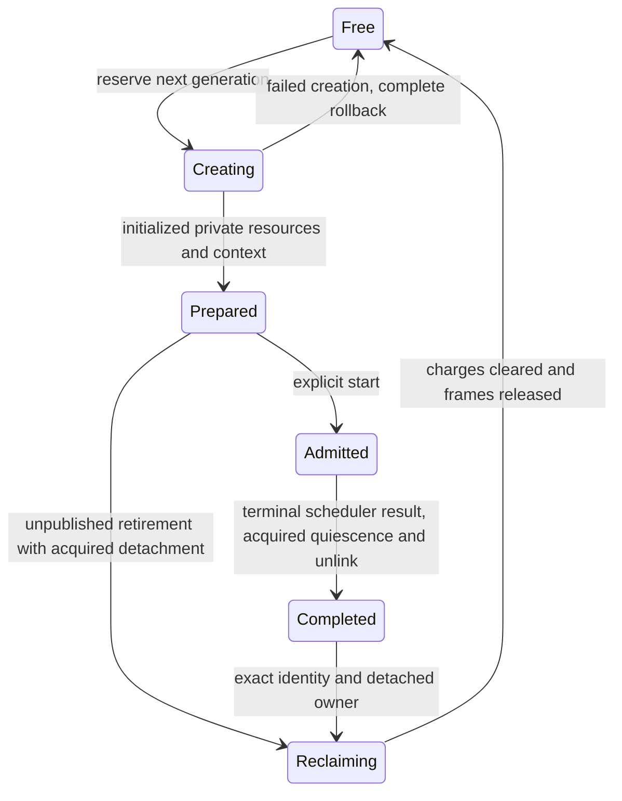
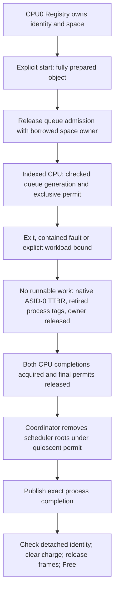

# Dynamic process lifecycle

Document status: CURRENT
Evidence scope: Phase 3.1, bounded two-CPU trusted-bootstrap processes; issue #20.
Current reference: [ADR-0017](../architecture-decisions/0017-process-lifecycle.md)

<a name="kolvrt-process-lifecycle"></a>

## Feature scope

The canonical feature record below describes bounded implementation; historical receipts remain bound to their recorded source. Next gates do not imply absent features already accepted elsewhere.

<a name="kolvrt-process-identity"></a>

## Identity and ownership

[ProcessId](../../crates/kernel-core/src/process.rs) contains a private slot and nonzero u64 generation. Reservation increments with checked arithmetic; failed creation burns its identity. Exhausted generations never wrap. Process identity is not authority, a handle or an external ABI. Fixed affinity currently derives from the reserved per-CPU slot range; future migration can move an owner without changing the slot/generation identity format.

One [Registry](../../crates/kernel/src/process.rs) is constructed by kernel_main and retained across workloads. A permanent singleton claim prevents a second registry or generation reset after dropping the first. Rust mutable ownership plus CPU0/IRQ observations protects the table; owned Frames make the registry non-Send/non-Sync. No process-table UnsafeCell or global process lock is added. CPU0 is the existing bootstrap physical allocator/coordinator, not a permanent admission policy for future services. Ordinary EL0 has no create endpoint. Explicit Origin::El0 is denied before reservation; a real unsupported EL0 create SVC faults only its caller.

Registry objects own private table/code/data/guarded-stack allocations through [OwnedUserSpace](../../crates/kernel/src/memory/mod.rs). Persistent charges survive forgotten guards. Admission descriptors borrow those owners rather than passing unretained raw root values. Only the indexed CPU mutates a published scheduler task; IRQ never accesses Registry. Bootstrap chooses trusted image, affinity and optional workload bounds; process identity never grants access to another object.

<a name="kolvrt-process-state"></a>

## State machine



Admitted includes runnable, executing and internally blocked ownership; Ready/Running/Blocked and terminal frame state are enforced inside the per-CPU scheduler. There is no misleading process-level Running flag updated by a coordinator before CPU execution. Completed is unavailable while any admitted task/root can execute. Repeated start, premature completion/reclaim, duplicate terminal publication and double reclaim fail; inaccessible Free slots reject even their last generation. Reuse cannot retarget stale process, task, report or completion references.

A prepared namespace that fails publication retires directly from Prepared to Reclaiming after acquired detachment, without becoming Admitted or publishing a waitable completion. Its handles and endpoints close, private frames roll back, and releasing the slot burns its identity. A real EL0 quota-exhaustion scenario exercises this failure and subsequent healthy-peer progress, replacement and final zero-resource quiescence. Host protocol checks also reject retirement without detachment or of an admitted process.

Completion distinguishes Exited(code), Faulted(class,address), Terminated, BudgetExpired and CreationFailed(step). FAR is included only for architectural abort classes; SVC/sysreg/unknown faults report zero instead of leaking a previous process's undefined FAR value. CreationFailed is returned with the failed attempt identity; it is not a partially live waitable object. Successful completion is a copied kernel-internal observation, repeatable until reclaim. validate_completion checks the live exact identity and terminal reason. This is not the future public wait API.

<a name="kolvrt-process-creation"></a>

## Creation transaction

Before reservation, validate bootstrap origin, observed caller/IRQ state, quiescent admission context, owner range, trusted image bounds, entry/stack, AArch64 EL0 PSTATE and nonzero optional slice limit. Five injected boundaries cover Slot, Frames, Space, Context and Commit on both target CPUs.

| Step    | Owned resource                                              | Rollback                                                                    |
| ------- | ----------------------------------------------------------- | --------------------------------------------------------------------------- |
| Slot    | Creating record and consumed generation                     | Return occupancy to Free, never rewind generation                           |
| Frames  | Zeroed contiguous allocation                                | Consume Frame through the authoritative physical pool                       |
| Space   | Private tables, RX image, RW data/stack and retained charge | Clear the unadmitted charge, then return every frame                        |
| Context | Valid initial architectural frame                           | Discard unpublished value and undo previous resources                       |
| Commit  | Prepared object owned by Registry                           | Failure occurs before object insertion/publication; undo previous resources |

No creation step publishes a runnable reference. start changes Prepared to Admitted; dispatch publishes only fully initialized admitted descriptors with release ordering. Capacity is the scheduler's explicit four slots per CPU, independent of fixture count. Exhaustion fails without allocation or overwrite. Image/stack/table resources use one bounded contiguous lease; no fallible heap growth occurs in process creation. The verifier checks physical availability, occupancy and stale failed identities after every injected failure, and subsequently allocates the entire table to expose retained charges.

<a name="kolvrt-process-reclamation"></a>

## Dispatch, completion and reclamation



The [scheduler](scheduler.md) keeps permanent queues and distinct dispatch generations. Empty slots are Vacant and never chosen; secondary-only and empty dispatch are supported. The small Admission descriptor excludes diagnostic report storage, preventing large report arrays from being copied through caller stacks. Full contexts, accounting and routing reports retain their previous semantics. Quiescent editing uses the existing exclusive inspection permit and the same three storage dereference sites.

Dispatch is a synchronous kernel-internal driver over admitted work, not the lifetime of Registry or a boot shutdown operation. It accepts an optional deadline; None imposes no hidden completion deadline. Without a deadline, return depends on admitted programs eventually terminating. Each exit/fault removes runnable execution; participating CPUs return to the native ASID-0 root, locally invalidate each terminal process ASID and publish completion only after barriers. Unsupported-ASID fallback performs full local TLBI on every switch. Scheduler roots are cleared before dispatch returns, so admission borrows can end safely. No Registry borrow is accessed from IRQ. No scope/ordinary lock spans ERET or completion waiting. Reclaim requires Completed, matching identity, no executing owner and acquired detached queues; timeout cannot authorize reclaim.

This first implementation conservatively requires both CPU dispatches to quiesce before reclaim or another admission round. It does not admit new work while an owner executes an existing round or reclaim one process while its peer remains active. The bounded step path supports one coalescing event latch per process slot: a harness SVC in step mode registers and rechecks the event, a blocked task detaches before `step()` returns, and trusted bootstrap code signals by exact live `ProcessId` through `Registry::signal`. The passing QEMU check exercises a signal before registration, all tasks blocked, an idle step, waking one task while its peer remains blocked, stale-generation rejection and retained/coalesced signals; the host test races publication against registration. The [wait contract](wait.md) records this limited protocol and evidence. It is not a generic wait API, external event loop, or cross-process wake mechanism; signal authority remains kernel-internal. Prepared and completed objects persist across dispatches; they are not reset with queue generations. Forgotten Registry/space ownership quarantines resources; dropping a live Registry is a fatal trusted invariant violation, and a new singleton cannot silently reset generations.

<a name="kolvrt-process-evidence"></a>

## Evidence and profile scope

The finite authority probe must execute the unsupported EL0 create SVC and retain its exact fault outcome. It uses the existing eight-quantum slice budget without a two-second verification deadline: deadline expiry before the instruction tests timing rather than authority. Slice exhaustion remains a failed probe, not an accepted denial. The external QEMU runner also bounds hangs. This timer-quantum cap is not a strict CPU-time isolation guarantee. Production scheduler deadline enforcement is unchanged. On a DEV failure, diagnostics report origin/image rejection flags, terminal reason and live occupancy; no payload or kernel pointer is logged.

Research reviewed 2026-10-05: [Linux kselftest](https://docs.kernel.org/dev-tools/kselftest.html) treats runner timeout as a separately configurable test condition; [Fuchsia Test Manager](https://fuchsia.dev/reference/fidl/fuchsia.test.manager) distinguishes failure from timeout, and [Zircon wait](https://fuchsia.dev/reference/syscalls/object_wait_one) distinguishes access denial from expiry. [seL4 MCS](https://docs.sel4.systems/Tutorials/mcs.html) enforces execution-time budget/period independently. These live primary references motivate separating test outcomes and resource limits; their architecture and numeric defaults are not KOLVRT authority or evidence of equivalent temporal isolation.

The Phase 3.1 [kernel results](../../research/results/kernel-phase31.json), [unsafe inventory](../../research/results/kernel-phase31-unsafe-audit.json), and [routing regression](../../research/results/routing-phase31-regression.json) retain that milestone's exact sources, artifacts and QEMU scope. Its 67-test receipt includes the bounded wait/block scenario; [wait contract](wait.md) describes its boundary. [Phase 3.2 results](../../research/results/kernel-phase3-2.json) add verified user-copy and contain 69 checks per DEV/PROD profile plus 57 host negative controls. That receipt's source hashes identify the tested Phase 3.2 snapshot; later handle and measurement changes have separate evidence. The separate [physical compatibility-source removal record](../../research/results/native-compat-removal-phase31.json) reports 65 tests per profile for its recorded source snapshot at commit `825d8d561e69e414088d6501dfa1ee939d495c99`; it is historical evidence, not a removal check of the current tree. Earlier Phase 3 and Phase 3.0 results remain separate historical records.

Bounded stress performs 32 rounds with one process on each CPU: 64 create/start/exit-or-fault/reclaim cycles per profile, including sixteen secondary faults and peer survival. Each round checks exact terminal reason, private tag, zero live occupancy and the original free-page count. On a failed ASID stress observation, the fixture retains its first failed cycle, expected public tag, both terminal reasons and actual public tags. A missing expected exit must not be silently interpreted as a TLB alias without that evidence. This is short deterministic QEMU stress, not long-term reliability, fuzzing or silicon weak-memory evidence. DEV emits slot/generation/owner/state and rollback-step traces; stripped PROD omits them. Both use one lifecycle implementation; profile optimization changes no mandatory validation, lifetime or failure outcome.

<a name="kolvrt-process-asid"></a>

## ASID lifecycle update (#18)

The current scheduler uses hardware-width-checked, fixed-affinity process ASID leases with a monotonic software epoch. Native root uses ASID zero. Ordinary tagged root switches do not issue TLBI; the owning CPU completes `TLBI ASIDE1` before terminal retirement and tag reuse. Both roots and frames remain retained until scheduler detachment and completion. Unsupported width keeps the full-flush mode. The DEV/PROD matrix includes four-ASID-per-CPU forced exhaustion, changed physical backing at the same user VA, same-VA isolation on both CPUs and frame reclamation. The negative `--asid-reuse-control` omits retirement invalidation and must fail `asid_reuse_requires_invalidation`; Omission can expose stale translations in QEMU TCG. The mandatory invalidation witness is checked before the dependent same-VA observation, so either TLB residency outcome preserves the exact expected rejection. Eight counterbalanced QEMU pairs are retained in [issue18-asid-measurements.json](../../research/results/issue18-asid-measurements.json); they are TCG timer observations, not hardware throughput. See [ADR-0021](../architecture-decisions/0021-asid-lifecycle.md).

<a name="kolvrt-process-limits"></a>

## Limits and next gate

Phase 3.1 added no IPC, user-copy, handles, capabilities, domains, ELF loader, migration, work stealing, package runtime or universal kernel object. Native dependencies remain kernel/kernel-core; routing policy stays in the optional EL0 image. Old bootstrap fixtures and that image now use the same create/start/dispatch/reclaim mechanism. Native-only builds require the same matrix after physical compatibility-package removal.

The accepted issue #22 user-copy boundary builds on exact process identity, privately retained address spaces, explicit admission, terminal isolation, scheduler detachment and nonreusable stale references. The Phase 3.2 boundary described below supplies fault-contained copies, access validation, immutable request snapshots and synchronous race exclusion; a ProcessId or numerical address is never a user-copy authorization. No public user-pointer API is introduced. Future asynchronous lifecycle needs an explicit retained lookup/borrow protocol and per-object quiescence before extending this conservative barrier. Handles/capabilities and public creation authority remain separate milestones.

## Phase 3.4 historical security boundary

[Security domains](domains.md) record the Phase 3.4 boundary: each process generation binds caller-local handles, explicit bootstrap grants and immutable caller-supplied memory/handle/queue/request quotas. SEND/TRANSFER rights attenuate; REVOKE=4 is explicit issuer authority. Revocation rejects new effects while accepted work retains its consumer charge and target through completion or service-fault cancellation. Closing a handle does not revoke aliases. The same-CPU notification pilot and its source receipt remain Phase 3.4 evidence; the later IPC design has been rederived for #26.

## Phase 3.5 bounded IPC status

[Native IPC](ipc.md) adds an experimental copied EL0 request transport, bounded endpoints, scoped SEND and nondelegable receiver authority, blocking cross-CPU waits, exact terminal arbitration and retained results. It extends process execution without adding EL0 process creation, migration, supervisor policy or persistent-service admission. Issue #26 acceptance is still pending, and this document's Phase 3.1/3.2 lifecycle receipts do not verify the changed current source.

[Russian translation](../../translations/ru/docs/kernel/processes.md)

<a name="kolvrt-process-copy-boundary"></a>

## Phase 3.2 current copy boundary

[Safe user-copy](user-copy.md) implements issue #22 over this retained generation/root ownership. A borrowed current-task Access checks range and EL0 permissions, copies an immutable bounded snapshot and contains precise copy faults. It ends before exit/root switching and cannot survive address-space reclamation. The synchronous whole-dispatch retirement barrier remains mandatory; mutable/shared mappings and asynchronous copy are unsupported. The earlier Phase 3.1 receipt remains historical evidence, while the Phase 3.2 matrix repeats every lifecycle check. No public process/handle authority is introduced.

<a name="kolvrt-process-handle-boundary"></a>

## Phase 3.3 process-local references

[Handle namespaces](handles.md) move linearly through admission and scheduling steps, preserving generations across ProcessId reuse. Exit/fault quiescence returns each namespace before all entries are retired and its owner unbound; reclamation rejects remaining entries or an accessible namespace. No handle borrows survive completion or frame release.

## Phase 3.6 lifecycle extension

Explicit authorized termination now has its own `Reason::Terminated`; `BudgetExpired` retains actual timer/budget meaning. Native lifecycle observation distinguishes these outcomes. The real EL0 shutdown checks that a requested stop produces Terminated rather than an invented budget expiry.

The experimental [supervisor](supervision.md) requests fresh processes through finite exact-image/placement/quota grants bound to its executing identity. Lifecycle work follows acquired native-root checkpoints on both CPUs; blocked peers retain IPC ownership and private frames. Replacement requires the current service token and actual old completion, preserving quotas and rejecting stale bindings. Failed publication rolls back unpublished resources. The earlier bootstrap-only milestone remains historical; the new API and [ADR-0026](../architecture-decisions/0026-el0-supervision.md) require separate semantic/EN-RU acceptance.

<!-- knowledge -->

```json
{
  "schema_version": 1,
  "id": "doc.kolvrt.kernel.processes",
  "kind": "subsystem-contract",
  "summary": "Current bounded process lifecycle and historical evidence.",
  "units": [
    {
      "id": "kolvrt.process.lifecycle",
      "anchor": "kolvrt-process-lifecycle",
      "kind": "feature",
      "summary": "Bounded trusted-bootstrap process creation, exit and quiescent reclamation.",
      "depends_on": [
        "kolvrt.process.identity",
        "kolvrt.process.state",
        "kolvrt.process.creation",
        "kolvrt.process.reclamation",
        "kolvrt.process.limits",
        "law.013",
        "law.025",
        "law.043"
      ],
      "feature": {
        "implementation": "BOUNDED_IMPLEMENTED",
        "implementation_scope": "Two fixed-affinity CPUs; trusted bootstrap admission, whole-dispatch retirement.",
        "sources": [
          "crates/kernel/src/process.rs",
          "crates/kernel-core/src/process.rs"
        ],
        "acceptance": ["research/results/kernel-phase31.json"],
        "issues": [20],
        "adrs": ["adr.0017"],
        "limitations": [
          "No public EL0 create API, migration or asynchronous retirement."
        ],
        "next_gate": "Re-derive per-object quiescence and public creation authority before extending lifecycle.",
        "verification": [
          {
            "environment": "qemu-arm64",
            "state": "STALE",
            "reason": "Phase 3.6 changes shared lifecycle/build/runner sources; historical receipts remain immutable, and their current exact-source applicability is not asserted before new scoped verification.",
            "scope": "The exact source digests, DEV/PROD and QEMU TCG configuration recorded by this receipt; physical ARM64 excluded.",
            "receipt": "research/results/kernel-phase31.json",
            "receipt_sha256": "6150c40258bf1eb5aa2ad7420fb7a958eee4af5ed29afcc7a3d53c341c73b542"
          },
          {
            "environment": "physical-arm64",
            "state": "UNKNOWN",
            "reason": "No physical ARM64 acceptance is established."
          }
        ],
        "readiness": "NOT_READY",
        "roadmap_gate": "Phase 3.1",
        "transitions": [
          {
            "from": "UNRECORDED",
            "to": "BOUNDED_IMPLEMENTED",
            "reason": "Initial reviewed catalog adoption of existing scoped contract; not a new implementation transition.",
            "acceptance": ["research/results/kernel-phase31.json"]
          }
        ]
      }
    },
    {
      "id": "kolvrt.process.identity",
      "anchor": "kolvrt-process-identity",
      "kind": "contract-section",
      "summary": "Process lifecycle: identity",
      "depends_on": ["adr.0017", "adr.0021"]
    },
    {
      "id": "kolvrt.process.state",
      "anchor": "kolvrt-process-state",
      "kind": "contract-section",
      "summary": "Process lifecycle: state",
      "depends_on": []
    },
    {
      "id": "kolvrt.process.creation",
      "anchor": "kolvrt-process-creation",
      "kind": "contract-section",
      "summary": "Process lifecycle: creation",
      "depends_on": []
    },
    {
      "id": "kolvrt.process.reclamation",
      "anchor": "kolvrt-process-reclamation",
      "kind": "contract-section",
      "summary": "Process lifecycle: reclamation",
      "depends_on": ["adr.0017", "adr.0021"]
    },
    {
      "id": "kolvrt.process.evidence",
      "anchor": "kolvrt-process-evidence",
      "kind": "contract-section",
      "summary": "Process lifecycle: evidence",
      "depends_on": []
    },
    {
      "id": "kolvrt.process.asid",
      "anchor": "kolvrt-process-asid",
      "kind": "contract-section",
      "summary": "Process lifecycle: asid",
      "depends_on": []
    },
    {
      "id": "kolvrt.process.limits",
      "anchor": "kolvrt-process-limits",
      "kind": "contract-section",
      "summary": "Process lifecycle: limits",
      "depends_on": []
    },
    {
      "id": "kolvrt.process.copy-boundary",
      "anchor": "kolvrt-process-copy-boundary",
      "kind": "contract-section",
      "summary": "Process lifecycle: copy-boundary",
      "depends_on": []
    },
    {
      "id": "kolvrt.process.handle-boundary",
      "anchor": "kolvrt-process-handle-boundary",
      "kind": "contract-section",
      "summary": "Process lifecycle: handle-boundary",
      "depends_on": []
    }
  ]
}
```
