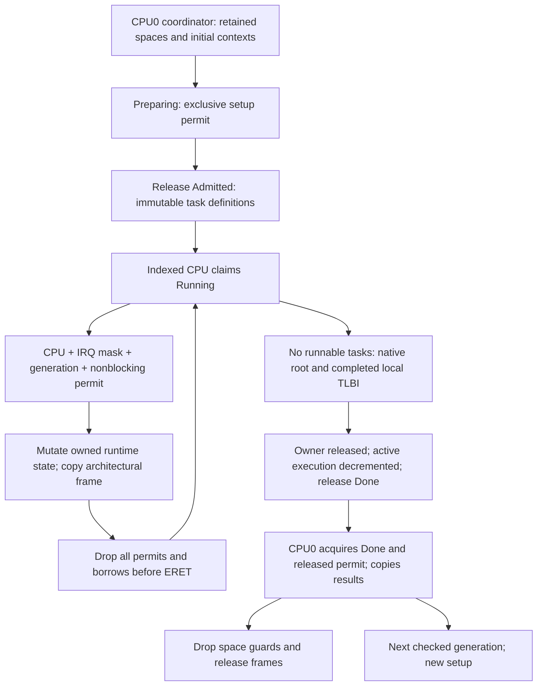

# Scheduler ownership foundation

Document status: CURRENT
Evidence scope: Phase 3.0 ownership and Phase 3.1 bounded two-CPU process lifecycle; fixed affinity.
Current reference: [ADR-0016](../architecture-decisions/0016-scheduler-ownership.md), [ADR-0017](../architecture-decisions/0017-process-lifecycle.md)

## Responsibilities

Previously, scheduler.rs held queue mutation, the architectural frame, marker/fault expectations, fixture data writes, allocation, image setup and report verification. Current responsibilities are:

```text
kernel-core/src/scheduling.rs             pure round-robin selection
kernel-core/src/scheduling/ownership.rs   safe atomic admission/access protocol
kernel/src/scheduler/config.rs           runtime capacity, independent of fixture count
kernel/src/scheduler/task.rs             immutable definition, runtime state, copied result
kernel/src/scheduler/local.rs            checked storage access; only scheduler UnsafeCell
kernel/src/scheduler/mod.rs              dispatch, preemption, native current-task lookup
kernel/src/arch/aarch64/context.rs        frame layout, architectural entry/trap boundary
kernel/src/arch/aarch64/entry.S           privileged vectors and context preservation
kernel/src/boot_workload.rs               trusted images/budgets, allocation, verification
kernel/src/boot_workload.S                static EL0 fault/register/stack fixture
```

Permanent CPU slots outlive the boot driver and its address spaces. The driver calls a reusable bounded runtime interface with retained spaces, initial contexts, slice budget and typed timeout. It neither dereferences scheduler storage nor resets queue phases directly. The kernel does not parse or select adapter policy.

The fixture still runs eight private processes: two surviving workers and six contained faults. It now queries its own slices using the existing native call and writes its own tick word in EL0. No fixture pointer or expected fault/marker remains in runtime scheduling. Final saved contexts, tags, stacks, peer-fault counts and progress are checked after acquired completion. Registers are initialized before publishing progress; the verifier rejects missing progress separately. This changes fixture instructions, not its required outcomes. Timing records from the old fixture are not equivalent-workload performance baselines.

## Ownership and publication



| Resource                                         | Owner and mutation                                                                | Lifetime/publication                                                                       |
| ------------------------------------------------ | --------------------------------------------------------------------------------- | ------------------------------------------------------------------------------------------ |
| CPU slot                                         | Immutable indexed owner; coordinator role is explicit                             | Permanent kernel storage; caller/workload lifetime cannot destroy it                       |
| Task definition                                  | Coordinator constructs identity, generation, root and budget; runtime has getters | Immutable after release admission; replacement only under checked preparing access         |
| Queue, current task, saved context, observations | Indexed CPU with IRQ masked and one exclusive access permit                       | Closures cannot return storage references; no borrow spans user entry, waits or completion |
| Completion/results                               | CPU0 reads after acquired Done and permit release                                 | Copied small results; reports copied in bounded chunks outside output/locking              |
| Address spaces/frames                            | Coordinator retains guards; each process has a fixed-CPU ASID lease               | Local ASID TLBI and acquired owner completion precede charge/frame/tag reuse               |

The safe ownership protocol checks observed caller role, IRQ mask, generation and phase before the local wrapper dereferences storage. A failed access never grants a second reference. Generation increments are checked and cannot wrap; stale state and task identity cannot bind to reused slots. Preparing → Admitted → Running → Done transitions exclude live reset and premature inspection. Done is consumable only after the final permit is released. Inspection excludes concurrent replacement. Per-task running-owner CAS continues to reject duplicate execution and fixed-affinity violations.

SESSION excludes overlapping bounded preparation; IRQ and dispatch never acquire it. It is an admission gate, not a queue lock. START/ARRIVED use release/acquire and participant RMWs within one generation; reset precedes admission. NATIVE_ROOT is immutable for that generation. RUNNING_OWNER uses per-task CAS/release; per-CPU scope/ordinary-lock markers are local lifetime checks.

CPU0 setup is the existing bounded allocator/coordinator role, not a permanent single-writer architecture for future services. During execution each indexed CPU owns its queue. Supporting other admission callers requires extending the explicit role/phase protocol, not bypassing the wrapper.

## IRQ, locks and progress

Timer IRQ stops/deasserts the source, acquires only the local nonblocking access permit to record preemption, then ends the GIC interrupt. The lower-EL trap uses a separate short permit for accounting/selection. Re-entry fails immediately; no spin waiting, allocation, UART output or ordinary lock exists on the successful path. All storage scopes end before ERET and all rendezvous/completion waits occur without a scope.

An ordinary lock held by the current CPU prohibits scheduler access; a scheduler storage scope prohibits acquiring an ordinary lock, including the heap lock. Guards cannot move to another CPU/thread. This has no global scheduler lock or nested lock order. It does not claim to detect arbitrary external wait dependencies or support nested IRQ. Fixed affinity, full context preservation, per-CPU ASIDs with ASID-zero/full-flush fallback, typed 1 ms quantum and timer-delivery assumptions remain. A process ASID is locally invalidated on terminal completion before its lease can be reused; migration and multi-CPU residency are unsupported. Historical foundation fixtures use sixteen slices/two seconds; current finite lifecycle probes use the independently documented quantum cap and dedicated deadline cases. The opaque payload retains its separate budget. Dispatch retains an explicit workload deadline, but its completion join has no arbitrary elapsed-time cutoff. Acquired completion and root detachment precede ownership return; time does not prove quiescence.

## Unsafe and mechanical checks

Scheduler storage retains exactly one unsafe Sync implementation and three UnsafeCell dereferences, all in local.rs: preparation, owned mutation and acquired inspection. The architecture boundary retains the reviewed assembly entry and raw trap-frame conversion; root activation retains privileged TTBR/TLBI operations. Boot verification retains immutable image slicing and post-quiescent volatile tag reads. All other memory, MMIO, heap, lock, firmware and register boundaries remain in the [unsafe register](unsafe.md); the complete [inventory](../../research/results/kernel-phase3-unsafe-audit.json) is not a safety proof.

Compiler privacy encapsulates raw storage and immutable definitions; higher-ranked closure lifetimes prohibit returning borrowed state. Atomic permits, phase/generation checks, exact task slot identity, per-CPU lock/scope tracking and running-owner CAS enforce runtime obligations equally in DEV/PROD. Compile-time context offsets/size preserve the 816-byte assembly ABI. Initial and selected return frames must be AArch64 EL0 with user IRQ enabled before ERET. A host source guard rejects fixture policy and raw storage outside its module; it is a bounded lexical guard. Host concurrency tests exercise the same safe protocol, not hardware IRQ behavior.

## Evidence and next boundary

[Results](../../research/results/kernel-phase3.json) retain exact sources and artifacts: 54 tests per DEV/PROD, including all previous 53 and repeated generation/reclamation without reboot; both non-test boots; the original eleven failure controls plus fifteen scheduler controls in both profiles, 41 total. Scheduler controls exercise foreign CPU mutation, duplicate start/run, stale state/task, actual timer-path re-entry, live reset/read, premature completion, unmasked mutation, both lock directions, privileged/AArch32 seeds and masked user IRQ. [Routing regression](../../research/results/routing-phase3-regression.json) covers the unchanged optional EL0 behavior; the native matrix runs without that payload. QEMU evidence does not establish silicon weak-memory behavior or arbitrary CPU counts.

Phase 3 — Native Process & Service Foundation proceeds only with separate authorization:

| Stage | Scope                                                                                                                          |
| ----- | ------------------------------------------------------------------------------------------------------------------------------ |
| 3.0   | Scheduler decomposition and ownership, #16/#17                                                                                 |
| 3.1   | Dynamic kernel-internal process lifecycle and bounded own-event wait/block, #20; public EL0 admission and wait remain deferred |
| 3.2   | Safe user-copy, #22                                                                                                            |
| 3.3   | Handles and capabilities, #23/#24                                                                                              |
| 3.4   | Security domains, #25                                                                                                          |
| 3.5   | IPC, waits and cancellation, #26                                                                                               |
| 3.6   | Supervisor, #27                                                                                                                |
| 3.7   | First persistent EL0 service, #28                                                                                              |

Phase 3.1 completes the bounded kernel-internal lifecycle requested for this milestone: generation-aware identity, transactional preparation, explicit admission, copied exit/fault completion and reclamation after scheduler detachment. Its process identity grants no authority. Public EL0 creation and waiting, persistent service admission and asynchronous retirement remain future work; the broader issue #20 is not automatically closed. No IPC, handles, capabilities, migration, work stealing or routing policy is added here. The bounded ELF loader in #21 is implemented; executable trust and a general loader ABI remain separate. [ASID lifecycle](el0.md#address-spaces-and-context) adds fixed-affinity leases without migration support. [Master tracker](https://github.com/lifeFedorovAlexey/KOLVRT/issues/37) records prerequisite order.

## Phase 3.1 lifecycle boundary

The [dynamic lifecycle](processes.md) extends this foundation with vacant slots and independent process generations. Kernel bootstrap retains one Registry across callers; old fixtures and the optional image use create/start/step/dispatch/signal/reclaim. The bounded [wait contract](wait.md) lets a stepped EL0 workload block on one own-process event and return to the bootstrap coordinator; it adds no public wait authority or production event loop. Admission descriptors borrow owned spaces, and roots are removed under acquired quiescent editing before returning process completion. Inspection and editing share the existing exclusive permit and three storage dereference sites. Optional bounds belong to the caller; None has no hidden completion deadline. The historical Phase 3.0 result records remain unchanged. [ADR-0017](../architecture-decisions/0017-process-lifecycle.md) records the conservative retirement boundary and next user-copy obligations.

## Phase 3.4 historical security boundary

[Security domains](domains.md) record the Phase 3.4 boundary: caller-local handles, explicit bootstrap grants, bounded quotas and a same-CPU notification pilot. The pilot's source receipt does not verify the new IPC path. Phase 3.5 has been rederived for #26 and adds a separate concrete endpoint mechanism.

## Phase 3.5 bounded IPC execution

[Native IPC](ipc.md) runs real EL0 peers through `dispatch_ipc()` in a continuous fixed-affinity session. Each owner keeps its scheduler state and native root while blocked, processes bounded deadlines and exact-generation mailbox work, and retires only after all peers and retained wakes quiesce. User copies, endpoint permits and scheduler storage occupy separate scopes; no global IPC lock is introduced. This is still experimental: complete wait/wake, terminal/accounting mutations, controlled performance paths and final source-bound acceptance are pending. The preceding Phase 3.0–3.4 receipts remain historical evidence for their declared sources.

[Russian translation](../../translations/ru/docs/kernel/scheduler.md)

## Phase 3.2 copy scope

[Safe user-copy](user-copy.md) borrows the current executing Task inside the same masked exclusive local scope. The bounded synchronous call never yields, allocates, locks or retains a user reference. Immutable admission roots/frames stay borrowed from Registry through dispatch. Exact process/space and queue generation, running ownership and current TTBR precede page access. A nested synchronous abort recovers only at audited unprivileged copy PCs; the outer lower-EL Context remains saved until ordinary return. IRQ nesting remains unsupported. Copy guard/borrow ends before task exit, root switching or ERET; the two-CPU retirement barrier is unchanged.

## Phase 3.3 namespace ownership

[Handle ownership](handles.md) uses existing publication/mutation/quiescent permits. Admission exclusively borrows each Registry namespace; a move places it into the indexed CPU state and acquired two-CPU completion returns it exactly once. The namespace remains linear across nonterminal steps. No new global lock or unsafe storage is introduced; retained resource borrows end inside the masked current-task callback.

## Phase 3.6 lifecycle checkpoint

Checkpoint completion and pending-copy drainage wait for actual acquired publication/quiescence without a fixed coordination deadline. Workload expiry still produces BudgetExpired, and only acquired completion plus root/execution-owner quiescence permit membership changes. The shared wait checks published secondary failure and fails with resources retained; silent stalls require external diagnosis and do not permit return or reclaim. Scheduler workload-deadline polling uses relaxed counter reads; context/accounting measurements keep ordered reads and trap-entry ISB. The Phase 3.7 maintainer decision supersedes the #126 finite-publication policy in ADR-0026.

The experimental [supervisor](supervision.md) uses a separately scoped two-CPU checkpoint. Exact IPC waits, retry reasons and counters remain retained; pending copy continuations finish before namespace transfer. Each CPU restores its native root and releases running ownership before CPU0 changes membership. SGI-only traps cannot spend the checkpoint timer quantum before EL0 executes. A saved cursor continues only for its matching live process generation. Root detachment of a blocked peer does not authorize reclaim. The purpose of continuous IPC dispatch is preserved; [ADR-0026](../architecture-decisions/0026-el0-supervision.md) is accepted for bounded functional scope after #126; performance readiness is separate.

UNIT callers under test_support/scheduler_inputs.rs instantiate the actual Local/Task/State types and invoke production methods with forbidden lock order, stale task generation and a running peer. The assertions are observed directly; production method bodies contain no test branches. Ownership tests import the single kernel-core protocol and check rejection plus retained phase/generation. Registry context tests submit invalid architectural frames through the actual create interface and verify unchanged resources. These checks do not establish corruption-detection or hardware concurrency coverage. The current full suite and evidence limits are described in [native applications](native-applications.md).

<!-- knowledge -->

```json
{
  "schema_version": 1,
  "id": "doc.kolvrt.kernel.scheduler",
  "kind": "subsystem-contract",
  "summary": "Fixed-affinity scheduler ownership, historical Phase 3 boundaries and experimental continuous IPC execution."
}
```
