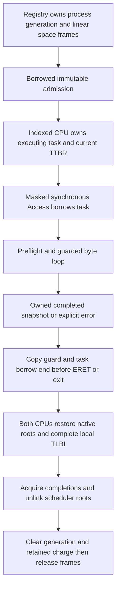

# Safe user copy

Document status: CURRENT
Evidence scope: Phase 3.2 bounded synchronous current-process copies on two fixed-affinity CPUs; issue #22.
Current reference: [ADR-0018](../architecture-decisions/0018-safe-user-copy.md)

<a name="kolvrt-memory-user-copy"></a>

## Feature scope

The canonical feature record describes the bounded implementation. Evidence is scoped to the receipt inputs; hardware and production readiness remain separate gates.

<a name="kolvrt-memory-user-copy-api"></a>

## API and limits

[Access and Snapshot](../../crates/kernel/src/user_copy.rs) form the native memory boundary. Scheduler-owned current task attribution constructs a non-Send/non-Sync Access borrowing the executing task. No user pointer becomes a Rust reference. The [safe range model](../../crates/kernel-core/src/user_copy.rs) uses checked arithmetic.

```rust
access.copy_from_user::<CAPACITY>(address, length) -> Result<Snapshot<CAPACITY>, Error>
snapshot.bytes() -> &[u8]
access.copy_to_user(address, initialized_bytes) -> Result<(), Error>
```

The implementation limit is 12,288 bytes per call. Snapshot capacity is explicit, checked against that limit, and uses fixed initialized kernel stack storage; it never allocates from a user-provided length. Callers should choose their actual request bound rather than the global maximum. DEV tests exposed excessive stack use from many simultaneous maximum-size temporaries; the fixture scopes large snapshots in separate functions. The platform has 256 KiB permanent EL1 stacks. This is a bounded implementation contract, not a stable public syscall ABI.

All ranges must lie inside the current 2 MiB user aperture starting at USER_BASE; null, kernel addresses and checked-add overflow fail. Nonempty spans require every covered page to have current EL0 read/write permission. A byte copy accepts unaligned addresses. Empty copies still validate identity and a non-null address inside the aperture but access no page; an unmapped in-aperture address is allowed for an empty copy. Capacity/size failure precedes range failure, which precedes page checks. A stale executing context is rejected before memory access.

Strings are length-delimited bytes with the same bound; no unbounded NUL scan or implicit string conversion exists. Consumers explicitly validate UTF-8 or another required encoding after copying. Requests are decoded from bytes; internal Rust structs, enums, padding and pointer-sized fields are never converted to wire bytes by this API. Any future wire representation requires explicit widths, byte order, versions and initialized reserved bytes under LAW-018.

<a name="kolvrt-memory-user-copy-faults"></a>

## Fault and partial-copy model

| Result                  | Meaning                                                                                   |
| ----------------------- | ----------------------------------------------------------------------------------------- |
| Success                 | All requested bytes copied; input exposes only the completed snapshot                     |
| TooLarge                | Length exceeds snapshot capacity or implementation maximum                                |
| InvalidRange            | Null, overflow, kernel address or aperture crossing                                       |
| PermissionDenied        | Hardware EL0 permission preflight denied the operation                                    |
| UserFault { copied: 0 } | Page preflight failed; no destination byte was written                                    |
| UserFault { copied: n } | A recoverable fault occurred at the exact copy instruction after n completed stores       |
| StaleContext            | Wrong CPU/root, queue/process generation, executing state, ownership or exclusion context |

Input failure discards private initialized scratch and publishes no snapshot, including after a partial low-level read. There is no caller destination to corrupt. Output preflight checks the whole span before its first store; a later architectural fault can leave a prefix written, and its exact count is returned as an error. Output is not a transactional write and callers must not infer success or roll back external effects from that count. Initialized byte slices prevent padding or uninitialized-data export; authority and explicit encoding remain caller obligations.

[AArch64 copy loops](../../crates/kernel/src/arch/aarch64/entry.S) use LDTRB/STTRB for user bytes, enforcing EL0 permissions even in EL1. Kernel-side loads/stores remain ordinary instructions with fatal invariant failure. [AT S1E0R/W preflight](../../crates/kernel/src/arch/aarch64/mod.rs) checks each page without dereferencing it. The synchronous vector recovers only translation/access/permission data aborts at the two exact user instruction PCs, with an active per-CPU copy guard, valid FAR inside the requested range, and matching read/write syndrome. Instruction aborts, external aborts, invalid FAR, wrong PC and all unrelated current-EL faults remain fatal. No generic exception-table or arbitrary kernel-fault recovery is introduced.

<a name="kolvrt-memory-user-copy-snapshot"></a>

## Snapshot and admission

```text
mutable EL0 bytes
  -> bounded copy into initialized private kernel storage
  -> completed immutable Snapshot
  -> decode and validate all fields
  -> check authority against that same snapshot
  -> admit operation
  -> execute
```

Success establishes memory validity, not capability authority. Consumers must retain the same snapshot for parse, validation and authorization; rereading mutable EL0 fields after admission would reintroduce TOCTOU. The EL0 fixture submits LE64 value 42, returns to EL0 and replaces it with 43, then verifies the admitted kernel value is still 42. A deliberately enabled live-reread control must fail. No handles, capabilities, domains, IPC or admission effects are implemented here.

<a name="kolvrt-memory-user-copy-lifetime"></a>

## Lifetime, SMP and mapping publication



Current-space validation checks the retained charge, exact process generation, current TTBR, indexed running owner, queue generation, linked Running state, masked IRQ and active exclusive scheduler scope. Space generations publish after initialized private mapping construction and before release queue admission. Registry remains mutably borrowed by synchronous dispatch, owns non-Send/non-Sync frames, and cannot reclaim or admit another round during execution. The copy token cannot escape a borrowed scheduler task or cross CPUs. All copy scopes end before return to EL0, completion waiting, exit or root switching. No allocation, ordinary lock, UART logging or yield occurs inside the copy operation.

There is one executing owner per private process; another CPU runs another private space. User page mutation/unmap, shared user mappings, process migration and asynchronous exit are not exposed. These races are mechanically excluded by current ownership and immutable mappings, rather than inferred from a one-time permission check. A future mutable/shared mapping API must introduce retained mapping exclusion or pinning before relaxing this contract. Hardware preflight alone would not establish that guarantee. ASID zero and full completed local TLBI remain unchanged. Fixed-affinity copying on two CPUs is tested; arbitrary CPU counts, silicon weak-memory behavior, DMA interference and side channels are unverified.

<a name="kolvrt-memory-user-copy-evidence"></a>

## Verification and measurements

[EL0 fixture and verifier](../../crates/kernel/src/user_copy/testing.rs) exercise both directions, unaligned and cross-page spans, null/kernel/unmapped/guard/foreign addresses, read-only output, overflow, empty and maximum spans, excessive sizes, terminal/unlinked task rejection and stale space generation. A test-only injection intentionally omits page preflight over a four-byte valid prefix plus guard page; production byte loops recover real mid-copy read/write faults and preserve untouched input suffix bytes. This models fault containment, not a supported unmap race. The output test verifies initialized known bytes, and both processes exit and reclaim their original frame count. Existing lifecycle rejection controls remain required.

The exact-source [Phase 3.2 receipt](../../research/results/kernel-phase32.json) passes 69 kernel checks per DEV/PROD profile and 57 host negative controls. The separate [unsafe inventory](../../research/results/kernel-phase32-unsafe-audit.json) records the privileged and assembly boundaries reviewed for this milestone.

The test endpoint and snapshot-retention fixture fields compile out of ordinary images. Native dependencies remain kernel/kernel-core; routing/compatibility remain in their EL0 image. DEV includes per-CPU attempts, preflight failures, recovery count and last rejected range/reason/syndrome, reported only after quiescence. PROD removes those diagnostics while preserving all checks, assembly and failure semantics. No profile-specific unsafe fast path exists.

Microbenchmarks retain four warmup and 32 raw measured input-copy observations per size and CPU: 8 bytes, one page, three pages and unmapped preflight failure. The runner validates unique scope/CPU attribution and recomputed quantiles. All cases select a 12 KiB snapshot capacity; successful copies initialize it, while preflight failure returns before initialization. The small-copy observation is not the cost of an eight-byte-capacity request. Timer ticks include validation, snapshot initialization, copying and return; test endpoint setup and serialization are outside the measured interval. Failure path measures preflight rejection, not a hardware abort. These QEMU TCG observations are regression foundations, not comparisons with Linux/macOS or hardware throughput claims.

Recorded timer ticks (62.5 MHz), 32 observations per cell:

| Input span         | DEV CPU0 median / p95 | DEV CPU1 median / p95 | PROD CPU0 median / p95 | PROD CPU1 median / p95 |
| ------------------ | --------------------- | --------------------- | ---------------------- | ---------------------- |
| 8 bytes            | 2687 / 2931           | 1537 / 1644           | 500 / 518              | 519 / 587              |
| 4096 bytes         | 3863 / 4143           | 2125 / 2388           | 1087 / 1194            | 1106 / 1118            |
| 12288 bytes        | 6244 / 6775           | 3456 / 3675           | 2350 / 2587            | 2294 / 2556            |
| Unmapped preflight | 369 / 381             | 262 / 269             | 31 / 112               | 32 / 50                |

The [physical native-only matrix](../../research/results/native-compat-removal-phase32.json) repeats 69/57 with all three compatibility packages absent and 56 unchanged native/harness files compared. The [Phase 2 routing regression](../../research/results/routing-phase32-regression.json) retains its six EL0 configurations, stripped boot and three rejection controls.

<a name="kolvrt-memory-user-copy-limits"></a>

## Unsafe and remaining gate

[INV-USER-COPY](unsafe.md) records ownership, necessity, failure and test obligations. The lexical inventory rises from 98 locations at the base commit to 106: four production sites (permission query, extern declarations and two calls), plus four test-only sites (fixture declaration/slice and two deliberate fault calls). There is no new unsafe process storage or Sync implementation. INV-USER-COPY-TEST adds only deliberate bounded fault injection. A lexical inventory is not a proof.

The separately accepted [handle contract](handles.md) uses completed bounded immutable request bytes, initialized output, explicit partial-write failure and generation-retained memory lifetime. It supplies its own identity/type/rights/close/transfer rules; general revocation and authority issuance remain separate gates. Successful copying supplies no authority and does not authorize later phases.

[Russian translation](../../translations/ru/docs/kernel/user-copy.md)

Phase 3.7 selects the ordinary real-copy fixture for snapshot/recovery coverage. The test imports the actual copy/recover methods, uses forbidden ranges and mismatched PC/FAR/direction inputs, and checks genuine guard-page partial-copy recovery, no escaped partial Snapshot and unchanged tail initialization. Snapshot stability is a positive invariant; its obsolete test-only verdict mutation is removed. The former recovery feature was a no-op and is removed; requiring a fatal marker from a valid suite was a runner defect. Named historical receipts above remain historical and are not current-source acceptance for this migration.

<!-- knowledge -->

```json
{
  "schema_version": 1,
  "id": "doc.kolvrt.kernel.user-copy",
  "kind": "subsystem-contract",
  "summary": "Bounded synchronous initialized snapshot copies across EL0 boundary.",
  "units": [
    {
      "id": "kolvrt.memory.user-copy",
      "anchor": "kolvrt-memory-user-copy",
      "kind": "feature",
      "summary": "Bounded synchronous initialized snapshot copies across EL0 boundary.",
      "depends_on": [
        "kolvrt.memory.user-copy.api",
        "kolvrt.memory.user-copy.faults",
        "kolvrt.memory.user-copy.snapshot",
        "kolvrt.memory.user-copy.lifetime",
        "kolvrt.memory.user-copy.limits",
        "kolvrt.process.identity",
        "kolvrt.process.reclamation",
        "law.018",
        "law.013"
      ],
      "feature": {
        "implementation": "BOUNDED_IMPLEMENTED",
        "implementation_scope": "Synchronous current-process copies over immutable mappings.",
        "sources": [
          "crates/kernel/src/user_copy.rs",
          "crates/kernel-core/src/user_copy.rs"
        ],
        "acceptance": ["research/results/kernel-phase32.json"],
        "issues": [22],
        "adrs": ["adr.0018"],
        "limitations": [
          "No asynchronous copy, shared mutable mappings or public pointer ABI."
        ],
        "next_gate": "Re-derive lifetime/exclusion before mutable mappings or asynchronous use.",
        "verification": [
          {
            "environment": "qemu-arm64",
            "state": "STALE",
            "reason": "Phase 3.7 removes source-copy mutation builds and application implementation copies. Tests use the actual production code; replacement fault/restart/shutdown and related acceptance scenarios remain incomplete. Prior receipts retain their historical scope; partial passes are not full current-source acceptance.",
            "scope": "The exact source digests, DEV/PROD and QEMU TCG configuration recorded by this receipt; physical ARM64 excluded.",
            "receipt": "research/results/kernel-phase32.json",
            "receipt_sha256": "6cb605f9ebde34d2af4d0608014911bbcd310336e4540cd829b2d219862a723e"
          },
          {
            "environment": "physical-arm64",
            "state": "UNKNOWN",
            "reason": "No physical ARM64 acceptance is established."
          }
        ],
        "readiness": "NOT_READY",
        "roadmap_gate": "Phase 3.2",
        "transitions": [
          {
            "from": "UNRECORDED",
            "to": "BOUNDED_IMPLEMENTED",
            "reason": "Initial reviewed catalog adoption of existing scoped contract; not a new implementation transition.",
            "acceptance": ["research/results/kernel-phase32.json"]
          }
        ]
      }
    },
    {
      "id": "kolvrt.memory.user-copy.api",
      "anchor": "kolvrt-memory-user-copy-api",
      "kind": "contract-section",
      "summary": "User-copy contract: api",
      "depends_on": []
    },
    {
      "id": "kolvrt.memory.user-copy.faults",
      "anchor": "kolvrt-memory-user-copy-faults",
      "kind": "contract-section",
      "summary": "User-copy contract: faults",
      "depends_on": []
    },
    {
      "id": "kolvrt.memory.user-copy.snapshot",
      "anchor": "kolvrt-memory-user-copy-snapshot",
      "kind": "contract-section",
      "summary": "User-copy contract: snapshot",
      "depends_on": []
    },
    {
      "id": "kolvrt.memory.user-copy.lifetime",
      "anchor": "kolvrt-memory-user-copy-lifetime",
      "kind": "contract-section",
      "summary": "User-copy contract: lifetime",
      "depends_on": []
    },
    {
      "id": "kolvrt.memory.user-copy.evidence",
      "anchor": "kolvrt-memory-user-copy-evidence",
      "kind": "contract-section",
      "summary": "User-copy contract: evidence",
      "depends_on": []
    },
    {
      "id": "kolvrt.memory.user-copy.limits",
      "anchor": "kolvrt-memory-user-copy-limits",
      "kind": "contract-section",
      "summary": "User-copy contract: limits",
      "depends_on": []
    }
  ]
}
```
