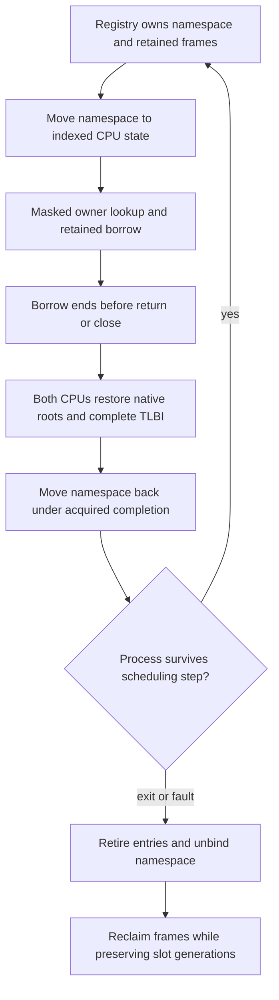

# Локальные дескрипторы процессов

Document status: CURRENT
Evidence scope: ограниченная Phase 3.3 на двух CPU с fixed affinity; exact-source QEMU verification, без authority и transfer.
Current reference: [ADR-0019](../architecture-decisions/0019-process-local-handles.md)

## Представление и caller context

[Примитивы](../../../../crates/kernel-core/src/handles.rs) кодируют opaque LE64: восемь младших бит slot, 56 бит generation; capacity — восемь записей. Это явный предварительный wire encoding, а не layout внутренней структуры. Generation zero — некорректная кодировка, а не специальный ресурс. Предсказуемые integer identity не являются секретами или authority.

Process slot сохраняет линейный namespace при ProcessId reuse. Binding хранит точный ProcessId; lookup проверяет caller, bounds, generation, live entry и expected kind. Одинаковые числа в разных namespaces могут означать разные ресурсы. Чужое число не выбирает таблицу другого процесса. [Native request path](../../../../crates/kernel/src/handles.rs) получает caller из scheduler-owned task и bound namespace, проверяет executing context Phase 3.2 и копирует 32-byte request в immutable snapshot.

```text
LE64 version=1, operation=(1 lookup | 2 close), handle, kind=(1 event | 2 completion)
safe copy -> decode snapshot -> current namespace -> generation/live/type check
           -> synchronous retained reference -> later independent authority gate
```

EL0 доступны lookup и close. Status words: 0 success, 1 invalid encoding/request, 2 stale, 3 wrong type, 4 foreign context, 5 inactive, 6 capacity, 7 generation exhaustion, 8 copy failure. Unknown version/opcode/kind отклоняется. Close также проверяет expected kind. Pointer, physical address, global object ID, internal enum layout и compatibility errno не передаются EL0. Создание выполняет trusted bootstrap/fixture; unprivileged object-creation authority API отсутствует.

## Владение и target lifetime

Каждый принадлежащий namespace ресурс имеет неизменяемый внутренний TargetId (создавший ProcessId, slot и generation резервирования), отдельный от process-local wire Handle. Перемещение namespace сохраняет TargetId; повторное использование slot создаёт другой ресурс. TargetId никогда не сериализуется в EL0 и не предоставляет authority.

Два конкретных targets — existing coalescing wait Event и owned immutable process Completion record. Completion удерживает значение, а не живой процесс или address space; его close не может завершить процесс. Event владеет latch storage. Этот узкий sum type не является universal KernelObject hierarchy или generic invocation interface.

Namespace непосредственно владеет targets в bounded initialized storage. Lookup возвращает Retained borrow, без allocation или reference count. Используемый borrow исключает mutable close/retire на уровне компилятора; это проверяет compile-fail test. Accepted work синхронен и заканчивается до close. Asynchronous retained requests, shared publishers и delegated references не реализованы. Close освобождает ровно одного owner и запрещает новые lookup; double close — Stale. Resource-specific методы доступны только trusted kernel code; успешный EL0 lookup не даёт read/write/terminate/delegate authority.



[Process ownership](../../../../crates/kernel/src/process.rs) сохраняет поколения namespace после retirement. [Scheduler integration](../../../../crates/kernel/src/scheduler/mod.rs) перемещает линейный namespace в owner state через existing publication permits и возвращает через quiescent editing после завершения двух CPU. Task metadata — копируемые evidence; namespaces и targets не клонируются. Global handle lock, новый UnsafeCell, unsafe Sync, raw-pointer cache и unchecked indexing не добавлены. Fixed affinity, private mappings и exclusive masked owner sections исключают lookup/close/retirement races. Migration, shared mappings и asynchronous operations требуют нового exclusion/retention proof.

DEV после quiescence показывает process slot/generation, capacity, active count, поколения/kinds live slots и retiring lifecycle; usable handles, raw kernel pointers и payload не выводятся. PROD исключает diagnostics, сохраняя проверки. Eight inline targets — deterministic quota процесса. Lookup/close не выделяют память, не блокируются, не уступают CPU, не логируют и не вызывают external service.

Подготовка runqueue инициализирует существующее хранилище под исключительным preparing permit, без передачи State по значению через фиксированный DEV-стек. Итоговый аудит воспроизвёл повреждение BSS из-за крупных временных объектов на стеке прежней реализации. Инициализация на месте устраняет эти копии и сохраняет continuity отчётов и ownership namespace.

## Generation и transactional publication

```text
reserve vacant slot -> burn generation -> prepare owned resource
 -> publish explicit handle bytes through safe copy -> infallible live commit
close -> remove owned resource -> lookup is stale
reuse same slot -> strictly greater generation
process exit/fault -> retire all entries -> unbind -> preserve counters
next ProcessId generation -> rebind same namespace -> old handle stays stale
```

Generation увеличивается при reservation, включая failed publication. Close немедленно убирает live state; следующая allocation увеличивает generation. При 2^56-1 vacant slot навсегда исчерпан. Wrap, truncation и automatic namespace reset отсутствуют. Другие available slots работают; Capacity отличается от GenerationExhausted. One-slot/two-generation instantiation проверяет тот же exhaustion algorithm в host и actual EL0 fixture. Практическая невозможность exhaustion не заявляется.

Создание владеет prepared target на kernel stack до успешной publication. Failure освобождает его, оставляя vacant slot с burned generation. Callback не может обращаться к exclusively borrowed namespace. В текущем private fixed-affinity процессе EL0 не может исполняться/читать partially published bytes во время synchronous callback; commit завершается до возврата. Partial copy failure может оставить stale bytes в user RAM, но никогда live entry. Shared mapping изменит этот publication proof и потребует redesign.

## Verification и performance gate

[EL0 verification](../../../../crates/kernel/src/handles/testing.rs) проводит forged/stale/wrong-kind lookup и double close через production copied request path. Два реальных процесса передают одинаковый raw handle: empty receiver не resolve sender resource. Eight two-CPU creation/exit/fault/reclaim rounds сохраняют handle generations при ProcessId slot reuse; проверяются frame counts и пустота namespace. Fixture покрывает live borrowed events, completion ownership, capacity, small-limit generation exhaustion, failed user publication и repeated close/reuse.

Пять build controls отключают реальные generation validation, owner validation, type checking, generation advancement или retirement cleanup. Runner должен обнаружить каждый в DEV и PROD. Изменяется enforcement, а не test expectation. Проверенная матрица включает existing Phase 3.2/lifecycle controls, native-only removal, routing regression, host tests, Clippy и repository checks.

Five per-CPU scopes сохраняют четыре warmups и 32 raw timer observations: successful lookup, failed lookup, create, close и slot reuse. Create измеряет target construction и namespace commit с no-op publication callback; user-copy/EL0 setup исключены. Close preparation вне интервала. Reuse измеряет create/close/create/close. Это regression baselines QEMU TCG, а не hardware throughput claims. Compiler-observation barriers материализуют промежуточные состояния namespace, исключая свёртку create/close/reuse. Кандидат фиксирует 73 source hashes, 72 checks и 67 negative controls.

Измерения timer ticks при 62,5 МГц, 32 samples на ячейку. Single-operation PROD observations близки к timer granularity; zero median означает квантованное измерение, а не нулевую стоимость выполнения. Hardware speedup из samples не следует:

| Scope                 | DEV CPU0 median / p95 | DEV CPU1 median / p95 | PROD CPU0 median / p95 | PROD CPU1 median / p95 |
| --------------------- | --------------------- | --------------------- | ---------------------- | ---------------------- |
| handle_lookup_success | 44 / 50               | 44 / 69               | 7 / 50                 | 6 / 7                  |
| handle_lookup_failure | 38 / 50               | 37 / 50               | 6 / 37                 | 6 / 7                  |
| handle_create         | 75 / 93               | 75 / 75               | 6 / 25                 | 6 / 7                  |
| handle_close          | 38 / 44               | 37 / 38               | 6 / 31                 | 6 / 12                 |
| handle_slot_reuse     | 206 / 225             | 194 / 206             | 6 / 44                 | 13 / 57                |

[Kernel receipt](../../../../research/results/kernel-phase33.json), [native-only receipt](../../../../research/results/native-compat-removal-phase33.json), [routing regression](../../../../research/results/routing-phase33-regression.json) и [unsafe inventory](../../../../research/results/kernel-phase33-unsafe-audit.json) сохраняют точную область измерений. Native-only сверяет 59 неизменных native/harness files; production unsafe delta — zero, три linked-fixture sites — test-only. Ранний CI встретил secondary CPU failure до ownership negative control; runner не принял это за успех и не скрывает отказ. Итоговый CI обязан пройти для опубликованного кандидата.

## Граница перед capabilities

Identity/type/lifetime checks возвращают resource reference, не разрешая effects. Phase 3.4 сможет добавить explicit admission checks вокруг того же caller namespace/retained resource без изменения handle identity. Rights representation, authority issuer, delegation, revocation и asynchronous accepted-work retention требуют своих контрактов. Issue #23 включает future rights/transfer acceptance и не закрывается bounded milestone. Linux fd/Windows HANDLE semantics, IPC, sharing/duplication, security domains, capability bits, magic current/root handles и universal object model исключены.

[Английский оригинал](../../../../docs/kernel/handles.md)
