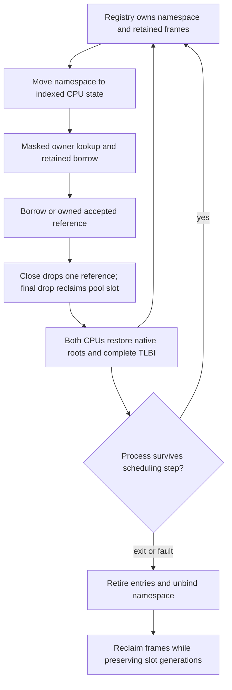

# Локальные дескрипторы процессов

Document status: CURRENT
Evidence scope: ограниченные caller-local handles с явными правами SEND/TRANSFER/REVOKE, attenuation общих targets и отзывом admission общего Event; два CPU с fixed affinity.
Current reference: [ADR-0020](../architecture-decisions/0020-handle-transfer-and-retention.md) для identity/transfer/lifetime handles с дополнением [ADR-0022](../architecture-decisions/0022-native-event-grants-and-revocation.md) для минимального Event grant/revoke среза.

## Представление и caller context

[Примитивы](../../../../crates/kernel-core/src/handles.rs) кодируют opaque LE64: восемь младших бит slot, 56 бит generation; capacity — восемь записей. Это явный предварительный wire encoding, а не layout внутренней структуры. Generation zero — некорректная кодировка, а не специальный ресурс. Предсказуемые integer identity не являются секретами или authority.

Process slot сохраняет линейный namespace при ProcessId reuse. Binding хранит точный ProcessId; lookup проверяет caller, bounds, generation, live entry, requested kind и необходимые rights. Одинаковые числа в разных namespaces могут означать разные ресурсы. Wire handle не выбирает таблицу другого процесса. [Native request path](../../../../crates/kernel/src/handles.rs) получает caller из scheduler-owned task и bound namespace, проверяет executing context и копирует 48-byte request в immutable snapshot до обращения к namespace.

```text
LE64[6] version=1, operation=(1 lookup | 2 close | 3 transfer | 4 revoke)
lookup/close: handle, kind, required_rights, reserved=0
transfer:     handle, receiver_process_slot, receiver_generation, requested_rights
revoke:       handle, reserved=0, reserved=0, reserved=0
safe copy -> decode snapshot -> current caller table -> generation/type/rights check
           -> receiver-local handle with the same target binding
```

EL0 доступны lookup, close, transfer и revoke общего Event. Rights: `SEND=1`, `TRANSFER=2`, `REVOKE=4`; неизвестные bits отклоняются. Bootstrap по умолчанию выдаёт Event только SEND, а Completion не получает прав; более широкие grants требуют явного trusted `create_*_with_rights`. REVOKE применим только к Event; такой grant для Completion отклоняется до резервирования поколения slot и публикации. Transfer требует TRANSFER и subset от выданных прав. Revoke требует REVOKE и атомарно запрещает новые signal admissions через все aliases. Сигнал, состязающийся с revoke, упорядочивается CAS состояния target; ранее принятая работа и уже pending notification сохраняются. Close удаляет только локальную ссылку и не является revoke. Получатель задаётся live ProcessId, уже привязанным к namespace на CPU вызывающего; запрос на другой CPU возвращает ForeignProcess. Status words: 0 success, 1 invalid encoding/request, 2 stale, 3 wrong type, 4 foreign context, 5 inactive, 6 capacity, 7 generation exhaustion, 8 copy failure, 9 rights denied, 10 retained-reference quota exhausted, 11 revoked. Unknown version/opcode/kind отклоняется. Close проверяет kind и generation. Pointer, physical address, global object ID, internal enum layout и compatibility errno не передаются EL0. Создание остаётся trusted bootstrap operation, не unprivileged object-creation authority API.

Real EL0 fixture отправляет revoke как copied 48-byte request и проверяет, что следующее SEND admission возвращает `Revoked`. Host controls проверяют, что delegated alias остаётся отозванным после source close. Эти проверки покрывают только Event slice и не подтверждают полные grant, service-lifecycle и security-domain критерии issue #24.

## Владение и target lifetime

Каждый принадлежащий namespace ресурс имеет неизменяемый внутренний TargetId (создавший ProcessId, slot и generation резервирования), отдельный от process-local wire Handle. Перемещение namespace сохраняет TargetId; повторное использование slot создаёт другой ресурс. TargetId никогда не сериализуется в EL0 и не предоставляет authority.

Два конкретных targets — existing coalescing wait Event и owned immutable process Completion record. Completion удерживает значение, а не живой процесс или address space; его close не может завершить процесс. Делегированные Event handles разделяют один atomic latch в fixed kernel pool из 512 слотов. У каждого слота nonwrapping generation и не более 1,024 live references. Namespace процесса по-прежнему содержит восемь записей; исчерпание пула или квоты references возвращает явную ошибку. Этот узкий sum type не является universal KernelObject hierarchy или generic invocation interface.

Каждая запись namespace владеет одной ссылкой на target. Lookup возвращает Retained borrow; `.retain()` создаёт owned reference для accepted work. Используемый borrow исключает mutable close/retire на уровне компилятора. Transfer проверяет обе таблицы до публикации новой receiver-local generation, attenuates rights и сохраняет TargetId. Revoke Event действует на все aliases; close убирает только одну запись и запрещает дальнейший lookup по этому token, а delegated entries и owned retained work сохраняют target. Double close — Stale. Resource-specific методы остаются kernel-only; rights проверяются перед admission, но не добавляют EL0 object pointer или универсальный invoke interface.



[Process ownership](../../../../crates/kernel/src/process.rs) сохраняет поколения namespace после retirement. [Scheduler integration](../../../../crates/kernel/src/scheduler/mod.rs) перемещает namespace в owner state через существующие publication permits и возвращает через quiescent editing после завершения двух CPU. Same-CPU lookup и EL0 transfer используют уже существующий scheduler ownership permit; table/object lock не приобретается. Cross-CPU тесты передают handle, пока обе таблицы принадлежат coordinator, затем запускают close исходной записи одновременно с lookup получателя на реальных EL0 CPU. Atomic reference count защищает shared Event. Новые UnsafeCell, unsafe Sync, raw-pointer cache и unchecked indexing не добавлены. User copy выполняется до доступа к namespace; lock или ownership permit не удерживаются через allocation, wait или external call.

DEV после quiescence показывает process slot/generation, capacity, active count, поколения/kinds live slots и retiring lifecycle; полные raw handle values, raw kernel pointers и payload не выводятся. PROD исключает diagnostics, сохраняя проверки. Квоты: восемь записей на процесс, 512 shared Event slots и 1,024 references на target. Lookup/close/transfer не выделяют память, не блокируются, не уступают CPU, не логируют и не вызывают external service.

Подготовка runqueue инициализирует существующее хранилище под исключительным preparing permit, без передачи State по значению через фиксированный DEV-стек. Итоговый аудит воспроизвёл повреждение BSS из-за крупных временных объектов на стеке прежней реализации. Инициализация на месте устраняет эти копии и сохраняет continuity отчётов и ownership namespace.

## Generation и transactional publication

```text
reserve vacant slot -> burn generation -> prepare owned resource
 -> publish explicit handle bytes through safe copy -> infallible live commit
close -> remove owned resource -> lookup is stale
reuse same slot -> strictly greater generation
process exit/fault -> retire all entries -> unbind -> preserve counters
next ProcessId generation -> rebind same namespace -> old handle stays stale
```

Generation увеличивается при reservation, включая failed publication. Close немедленно убирает live state; следующая allocation увеличивает generation. При 2^56-1 vacant slot навсегда исчерпан. Wrap, truncation и automatic namespace reset отсутствуют. Другие available slots работают; Capacity отличается от GenerationExhausted. One-slot/two-generation instantiation проверяет тот же exhaustion algorithm в host и actual EL0 fixture. Практическая невозможность exhaustion не заявляется.

Создание владеет prepared target на kernel stack до успешной publication. Failure освобождает его, оставляя vacant slot с burned generation. Callback не может обращаться к exclusively borrowed namespace. В текущем private fixed-affinity процессе EL0 не может исполняться/читать partially published bytes во время synchronous callback; commit завершается до возврата. Partial copy failure может оставить stale bytes в user RAM, но никогда live entry. Shared mapping изменит этот publication proof и потребует redesign.

## Verification и performance gate

Retirement-control требует отдельное событие handle-retirement-reject: посторонний panic не засчитывается как ожидаемое отклонение нарушения cleanup invariant.

[EL0 verification](../../../../crates/kernel/src/handles/testing.rs) проверяет forged/stale/wrong-kind lookup, double close, required rights и transfer через production copied request path. Получатель получает собственный token на тот же TargetId с правом только SEND; escalation прав и заполненная receiver table отклоняются без частичного transfer. Исходный handle закрывается до завершения accepted work. Два CPU также получают делегированные ссылки и выполняют конкурентные close исходной записи/lookup получателя на одном atomic Event. Восемь двухъядерных циклов creation/exit/fault/reclaim сохраняют handle generations при ProcessId slot reuse; проверяются frame counts, target identity и cleanup namespace. Fixture также покрывает completion ownership, capacity, small-limit generation exhaustion, failed user publication и repeated close/reuse.

Шесть build controls отключают реальные generation validation, owner validation, type checking, generation advancement, retirement cleanup или transfer rights enforcement. Runner должен обнаружить каждый в DEV и PROD. Изменяется enforcement, а не test expectation. Retire проверяется отдельным handle-retirement-reject событием, чтобы посторонний panic не считался нужным отказом. Проверенная матрица включает existing Phase 3.2/lifecycle controls, native-only removal, routing regression, host tests, Clippy и repository checks.

Five per-CPU scopes сохраняют четыре warmups и 32 raw timer observations: successful lookup, failed lookup, create, close и slot reuse. Create измеряет target construction и namespace commit с no-op publication callback; user-copy/EL0 setup исключены. Close preparation вне интервала. Reuse измеряет create/close/create/close. Это regression baselines QEMU TCG, а не hardware throughput claims. Compiler-observation barriers материализуют промежуточные состояния namespace, исключая свёртку create/close/reuse. Эти числа — исходный baseline Phase 3.3; текущий exact-source receipt issue #23 записан отдельно.

Измерения timer ticks при 62,5 МГц, 32 samples на ячейку. Single-operation PROD observations близки к timer granularity; zero median означает квантованное измерение, а не нулевую стоимость выполнения. Hardware speedup из samples не следует:

| Scope                 | DEV CPU0 median / p95 | DEV CPU1 median / p95 | PROD CPU0 median / p95 | PROD CPU1 median / p95 |
| --------------------- | --------------------- | --------------------- | ---------------------- | ---------------------- |
| handle_lookup_success | 44 / 50               | 50 / 75               | 6 / 7                  | 6 / 13                 |
| handle_lookup_failure | 38 / 50               | 37 / 44               | 6 / 125                | 6 / 7                  |
| handle_create         | 68 / 81               | 69 / 88               | 6 / 31                 | 6 / 13                 |
| handle_close          | 44 / 56               | 44 / 50               | 6 / 31                 | 6 / 63                 |
| handle_slot_reuse     | 206 / 218             | 212 / 225             | 6 / 13                 | 6 / 19                 |

[Issue #23 exact-source receipt](../../../../research/measurements/runs/1791022558822-issue23-transfer-bf3f9b298688.json) фиксирует 73 DEV/PROD checks и 69 negative controls. [Исходный baseline Phase 3.3](../../../../research/results/kernel-phase33.json), [native-only receipt](../../../../research/results/native-compat-removal-phase33.json), [routing regression](../../../../research/results/routing-phase33-regression.json) и [unsafe inventory](../../../../research/results/kernel-phase33-unsafe-audit.json) сохраняют отдельные области. Native-only сверяет 59 неизменных native/harness files; production unsafe delta — zero, три linked-fixture sites — test-only.

## Пределы authority и координации

Handle generation остаётся identity, а SEND/TRANSFER отдельно ограничивают lookup/admission и delegation. Issue #23 добавляет attenuation и bounded owned Event retention. В будущем можно определить grant issuer, revocation и более широкие async work guarantees без изменения handle identity. EL0 transfer адресует receiver namespace того же CPU; другой CPU отклоняется до изменения таблиц. Семантика Linux fd/Windows HANDLE, общий IPC, security domains, magic current/root handles и universal object model исключены.

[Английский оригинал](../../../../docs/kernel/handles.md)
