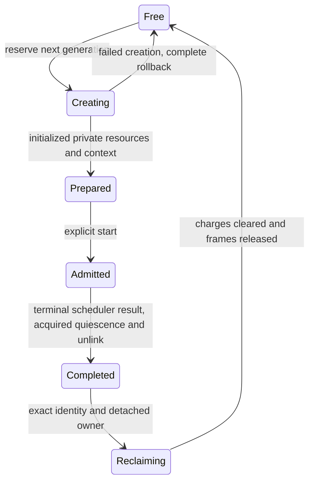
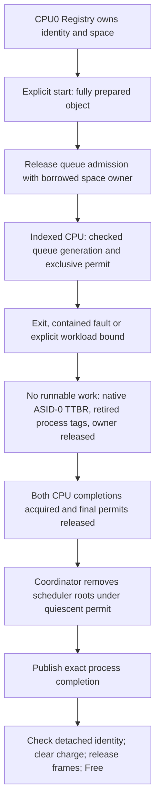

# Жизненный цикл динамических процессов

Document status: CURRENT
Evidence scope: ограниченные процессы Phase 3.1 для доверенного загрузочного кода на двух CPU; задача #20.
Current reference: [ADR-0017](../architecture-decisions/0017-process-lifecycle.md)

## Идентичность и владение

[ProcessId](../../../../crates/kernel-core/src/process.rs) содержит закрытые номер слота и ненулевое поколение `u64`. При резервировании поколение увеличивается с проверкой переполнения; неудачная попытка создания расходует идентификатор. Исчерпанное поколение не оборачивается. Идентификатор процесса не является полномочием, дескриптором или внешним ABI. Сейчас фиксированное закрепление процесса за CPU задаётся зарезервированным диапазоном его слотов; будущая миграция может сменить CPU-владельца, не меняя формат идентификатора.

Один [Registry](../../../../crates/kernel/src/process.rs) создаётся при запуске ядра и сохраняется между нагрузками. Постоянный признак уже созданного единственного экземпляра запрещает создать второй реестр или сбросить поколения после уничтожения первого. Таблицу защищают владение памятью в Rust и проверка CPU0/IRQ; принадлежащие реестру кадры делают его непередаваемым между потоками и CPU. Для таблицы процессов не добавлялись UnsafeCell и глобальная блокировка. CPU0 уже выполняет роль распределителя физической памяти и координатора загрузки, но это не предрешает постоянную политику допуска будущих служб. У обычного EL0 нет точки входа для создания процесса. Запрос с явным источником `Origin::El0` отклоняется до резервирования; реальный неподдерживаемый вызов создания через SVC вызывает отказ только в вызывающем процессе.

Объекты реестра владеют закрытыми таблицами страниц, кодом, данными и стеком с защитной страницей через [OwnedUserSpace](../../../../crates/kernel/src/memory/mod.rs). Учтённая за ними память остаётся занятой даже при забытом объекте-защитнике. Дескрипторы допуска временно заимствуют владельцев адресных пространств вместо передачи не удерживаемого корня. Опубликованную задачу планировщика изменяет только соответствующий ей CPU; обработчик IRQ не обращается к реестру. Доверенная загрузка выбирает образ, закрепление за CPU и, при необходимости, предел нагрузки; идентификатор процесса не даёт доступа к чужому объекту.

## Конечный автомат состояний

Состояние `Admitted` охватывает и готовность к запуску, и фактическое исполнение; состояния `Ready`/`Running` и конечное состояние кадра контролирует внутренний планировщик каждого CPU. Координатор не выставляет вводящий в заблуждение признак `Running` до начала исполнения на CPU. Процесс нельзя считать завершённым, пока допущенная задача или её корень адресного пространства могут исполняться. Повторный запуск, преждевременное завершение или освобождение, повторная публикация конечного результата и двойное освобождение отклоняются. Свободный слот не принимает устаревшее поколение. Повторное использование слота не перенаправляет устаревшие ссылки на процесс, задачу, отчёт или результат.

Результат завершения различает `Exited(code)`, `Faulted(class,address)`, `BudgetExpired` и `CreationFailed(step)`. Адрес FAR указывается только для соответствующих архитектурных исключений отмены доступа; при отказах SVC, системных регистрах и неизвестных причинах возвращается ноль, чтобы не раскрыть неопределённое значение FAR предыдущего процесса. При `CreationFailed` возвращается идентификатор неудачной попытки; такой процесс не остаётся частично созданным объектом, за завершением которого можно наблюдать. Успешный результат — внутренняя копия состояния ядра; её можно читать повторно до освобождения процесса. `validate_completion` проверяет точное совпадение действующего идентификатора и конечной причины. Это не будущий открытый API ожидания.

## Транзакция создания

До резервирования проверяются источник запроса загрузки, состояние вызывающего CPU и IRQ, возможность безопасно начать допуск, диапазон слотов владельца, границы доверенного образа, точка входа и стек, регистр состояния AArch64 EL0 PSTATE и ненулевой предел временных срезов, если он задан. Пять точек внедрения отказа — `Slot`, `Frames`, `Space`, `Context` и `Commit` — проверяются для обоих целевых CPU.

| Шаг       | Ресурс во владении                                                            | Откат                                                                              |
| --------- | ----------------------------------------------------------------------------- | ---------------------------------------------------------------------------------- |
| `Slot`    | Запись `Creating` и израсходованное поколение                                 | Освободить слот, не откатывая поколение                                            |
| `Frames`  | Обнулённый непрерывный участок памяти                                         | Вернуть кадры единственному владельцу — распределителю физической памяти           |
| `Space`   | Закрытые таблицы страниц, образ RX, данные и стек RW, учтённый участок памяти | Снять не допущенное к исполнению резервирование и вернуть все кадры                |
| `Context` | Корректный исходный архитектурный кадр                                        | Отбросить неопубликованный кадр и освободить предыдущие ресурсы                    |
| `Commit`  | Подготовленный объект во владении реестра                                     | Отказ происходит до добавления и публикации объекта; освободить предыдущие ресурсы |

Ни один шаг создания не публикует ссылку на исполняемую задачу. Операция `start` переводит `Prepared` в `Admitted`; операция `dispatch` публикует с порядком release только полностью подготовленные дескрипторы. Вместимость явно ограничена четырьмя слотами планировщика на CPU и не зависит от числа тестовых процессов. При исчерпании ресурсов создание завершается без выделения памяти и перезаписи данных. Для образа, стека и таблиц страниц используется один ограниченный непрерывный участок; создание не требует последующего расширения кучи, которое могло бы завершиться отказом. Проверяющий код после каждой внедрённой ошибки сверяет доступную физическую память, занятые слоты и устаревшие идентификаторы, а затем заполняет всю таблицу, чтобы обнаружить удержанные участки памяти.

## Запуск, завершение и освобождение

[Планировщик](scheduler.md) сохраняет очереди между запусками и отдельные поколения запуска. Пустые слоты имеют состояние `Vacant` и никогда не выбираются; поддержаны запуск только на вторичном CPU и запуск с пустыми очередями. Небольшой дескриптор допуска не содержит диагностических отчётов, поэтому большие массивы отчётов не копируются через стеки вызывающего кода. Полные контексты, учёт работы и отчёты маршрутизации сохраняют прежнюю семантику. Ограниченный [контракт ожидания](wait.md) позволяет задаче EL0 заблокироваться на собственном событии и вернуть управление загрузочному координатору; он не открывает публичный API ожидания и не вводит промышленный цикл обработки событий. Безопасное изменение остановленных очередей использует уже существующее исключительное разрешение на проверку и те же три места разыменования хранилища.

`Dispatch` — синхронный внутренний механизм ядра для запуска допущенных задач; он не определяет время жизни реестра и не выключает систему после загрузки. Он может принимать предельное время выполнения; значение `None` не добавляет скрытого ограничения. Без предела времени возврат зависит от того, завершатся ли допущенные программы. При выходе или отказе задача удаляется из исполняемых; задействованные CPU возвращаются к native root с ASID zero, локально инвалидируют ASID каждого terminal process и публикуют completion только после barriers. Fallback для неподдерживаемого ASID выполняет full local TLBI при каждом switch. Корни планировщика очищаются до возврата из `dispatch`, поэтому временные заимствования адресных пространств можно безопасно завершить. IRQ не обращается к заимствованиям реестра. Область действия заимствования и обычная блокировка не охватывают переход EL0 через `ERET` и ожидание завершения. Для освобождения требуются состояние `Completed`, совпадающая идентичность, отсутствие исполняющего владельца и подтверждённое отсоединение очередей; тайм-аут не разрешает освобождение.

Первая реализация требует, чтобы оба CPU завершили текущий запуск и перешли в безопасное состояние, прежде чем освободить ресурсы или начать следующий цикл допуска. Во время текущего цикла новые задачи не добавляются; нельзя освободить процесс, пока его соседняя задача активна. Ограниченный путь `step` поддерживает один объединяемый event latch на поколение процесса: тестовый SVC из EL0 регистрирует ожидание и повторно проверяет событие, заблокированная задача отсоединяется до возврата из `step`, а доверенный код загрузки посылает сигнал точной активной идентичности процесса через `Registry::signal`. Успешная проверка QEMU охватывает сигнал до регистрации, блокировку всех задач, возврат шага без готовых задач, пробуждение одной задачи при заблокированной соседней, устаревшее поколение и сохранённые/объединённые сигналы; хостовый тест создаёт гонку публикации и регистрации. Эта проверка не создаёт универсальный API ожидания, внешний цикл обработки событий или механизм пробуждения другого процесса; посылать сигнал может только код ядра. Объекты `Prepared` и `Completed` сохраняются между запусками и не сбрасываются вместе с поколениями очередей. Если забыть владельца реестра или адресного пространства, ресурсы остаются в карантине. Уничтожение действующего реестра считается нарушением доверенного инварианта; новый экземпляр не может незаметно сбросить поколения.

## Данные проверок и границы профилей

Свидетельства Phase 3.1 сохраняют [результаты ядра](../../../../research/results/kernel-phase31.json), [инвентаризацию unsafe-кода](../../../../research/results/kernel-phase31-unsafe-audit.json) и [регрессионные проверки маршрутизации](../../../../research/results/routing-phase31-regression.json) для того снимка исходников и запуска QEMU. [Контракт ожидания](wait.md) описывает границы проверенного пути. Отчёт Phase 3.1 содержал 67 проверок на профиль. [Отчёт Phase 3.2 для точного снимка исходников](../../../../research/results/kernel-phase3-2.json) подтверждает 69 проверок на профиль и 57 отрицательных контролей на хосте, включая ограниченные ожидание и копирование пользовательских данных; хеши исходников определяют проверенный исторический снимок, а последующие изменения имеют отдельные свидетельства. Физическое удаление пакетов совместимости подтверждено отдельной [записью](../../../../research/results/native-compat-removal-phase31.json) на 65 тестов для прежнего снимка кода; она историческая и не проверяет текущее дерево. Результаты Phase 3 и 3.0 также сохранены отдельно.

Ограниченная стресс-проверка выполняет 32 цикла с одним процессом на каждом CPU: 64 цикла создания, запуска, завершения или отказа и освобождения на профиль, включая шестнадцать отказов на вторичном CPU и проверку продолжения работы парной задачи. Каждый цикл проверяет точную причину завершения, закрытую метку задачи, отсутствие занятых слотов и исходное число свободных страниц. Это короткая детерминированная проверка в QEMU, а не доказательство длительной надёжности, fuzz-тестирования или поведения слабой модели памяти на реальном оборудовании. DEV выводит трассы слота, поколения, владельца, состояния и шага отката; PROD без диагностики их исключает. Профили DEV с диагностикой и PROD без неё используют одну реализацию жизненного цикла; оптимизация профиля не меняет обязательные проверки, время жизни ресурсов и результат отказа.

## Обновление ASID lifecycle (#18)

Текущий scheduler использует process ASID leases с проверенной аппаратной шириной, fixed affinity и монотонным software epoch. Native root использует ASID zero. Обычный tagged-root switch не выполняет TLBI; CPU-владелец завершает `TLBI ASIDE1` до terminal retirement и повторной выдачи tag. Roots и frames удерживаются до scheduler detachment и completion. Для неподдерживаемой ширины остаётся full-flush mode. Матрица DEV/PROD проверяет exhaustion с четырьмя ASID на CPU, новую physical backing для того же user VA, same-VA isolation на обоих CPU и frame reclamation. Негативный `--asid-reuse-control` убирает retirement invalidation и обязан провалить `asid_reuse_requires_invalidation`; QEMU TCG при этом сохраняет isolation. Восемь counterbalanced QEMU-пар сохранены в [issue18-asid-measurements.json](../../../../research/results/issue18-asid-measurements.json); это TCG timer observations, не hardware throughput. См. [ADR-0021](../architecture-decisions/0021-asid-lifecycle.md).

## Ограничения и следующий gate

Phase 3.1 не добавила IPC, безопасное копирование между адресными пространствами, дескрипторы, capabilities, домены безопасности, загрузчик ELF, миграцию, кражу задач, среду пакетов или универсальный объект ядра. Собственные зависимости остаются в `kernel` и `kernel-core`; политика маршрутизации находится в необязательном образе EL0. Старые загрузочные тестовые задачи и этот образ теперь используют один механизм создания, запуска, диспетчеризации и освобождения. Для сборок только с собственным кодом ту же матрицу нужно выполнять после физического удаления compatibility-пакетов.

Issue #22 сможет опереться на точную идентичность процесса, закрыто удерживаемые адресные пространства, явный допуск, изоляцию завершённых задач, отсоединение очередей и запрет повторного использования устаревших ссылок. Описанная ниже граница Phase 3.2 предоставляет fault-contained copies, проверку доступа, immutable request snapshots и синхронное исключение гонок. `ProcessId` и числовой адрес не дают права копировать данные пользователя. Публичного API с указателями пользователя нет. Для асинхронного жизненного цикла до ослабления текущего барьера потребуется явный протокол удержания ссылки и заимствования, а также безопасное изменение каждого объекта. Дескрипторы, capabilities и публичные полномочия создания процессов остаются отдельными этапами.

## Phase 3.4 current security boundary

[Security domains](domains.md) связывают каждую process generation с локальными handles, явными bootstrap grants и неизменяемыми memory/handle/queue/request quotas, переданными caller. SEND/TRANSFER rights допускают attenuation; REVOKE=4 означает явную issuer authority. Revocation запрещает новые effects, а принятая работа удерживает consumer charge и target до completion либо service-fault cancellation. Закрытие handle не отзывает aliases. Ограниченный same-CPU notification pilot сообщает EL0 terminal outcomes; general IPC, automatic wakeups, supervisor policy и persistent services относятся к следующим этапам. Перед расширением storage и encoding нужно заново вывести из требований #26/#27.

[Английский оригинал](../../../../docs/kernel/processes.md)

## Текущая copy boundary Phase 3.2

[Safe user-copy](user-copy.md) реализует issue #22 поверх этого retained generation/root ownership. Borrowed current-task Access проверяет range и права EL0, копирует immutable bounded snapshot и содержит precise copy faults. Он заканчивается до exit/root switching и не может пережить address-space reclamation. Синхронный whole-dispatch retirement barrier остаётся обязательным; mutable/shared mappings и asynchronous copy не поддерживаются. Ранний Phase 3.1 receipt остаётся историческим evidence, а Phase 3.2 matrix повторяет все lifecycle checks. Public process/handle authority не добавлены.

## Локальные ссылки процессов в Phase 3.3

[Handle namespaces](handles.md) линейно перемещаются через admission и scheduling steps, сохраняя поколения при ProcessId reuse. После quiescence exit/fault namespace возвращается; все записи retired, owner unbound. Reclamation отклоняет оставшиеся entries или доступный namespace. Handle borrows не переживают completion или освобождение frames.
