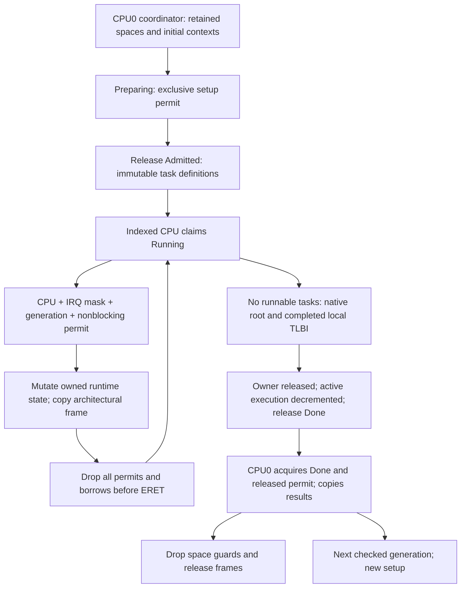

# Фундамент ownership scheduler

Document status: CURRENT
Evidence scope: Владение Phase 3.0 и ограниченный жизненный цикл процессов Phase 3.1 на двух CPU; фиксированная привязка.
Current reference: [ADR-0016](../architecture-decisions/0016-scheduler-ownership.md), [ADR-0017](../architecture-decisions/0017-process-lifecycle.md)

## Обязанности

Раньше scheduler.rs объединял изменение очередей, архитектурный frame, ожидаемые markers/faults, запись в fixture data, выделение памяти, подготовку images и проверку reports. Теперь обязанности разделены:

```text
kernel-core/src/scheduling.rs             чистый выбор round-robin
kernel-core/src/scheduling/ownership.rs   безопасный атомарный протокол admission/access
kernel/src/scheduler/config.rs           runtime capacity, независимая от fixture count
kernel/src/scheduler/task.rs             immutable definition, runtime state, копия результата
kernel/src/scheduler/local.rs            проверяемый доступ; единственный scheduler UnsafeCell
kernel/src/scheduler/mod.rs              dispatch, preemption, native current-task lookup
kernel/src/arch/aarch64/context.rs        layout frame, архитектурная граница entry/trap
kernel/src/arch/aarch64/entry.S           privileged vectors и сохранение context
kernel/src/boot_workload.rs               trusted images/budgets, allocation, verification
kernel/src/boot_workload.S                статический EL0 fixture faults/registers/stacks
```

Постоянные CPU slots существуют дольше boot driver и его address spaces. Driver вызывает повторно используемый ограниченный runtime interface с удерживаемыми spaces, initial contexts, slice budget и типизированным timeout. Он не разыменовывает scheduler storage и не сбрасывает queue phases напрямую. Kernel не разбирает и не выбирает adapter policy.

Fixture по-прежнему запускает восемь частных процессов: два выживающих worker и шесть contained faults. Теперь он запрашивает собственные slices через существующий native call и сам пишет tick word в EL0. Runtime scheduling не содержит fixture pointer или ожидаемых fault/marker. Финальные saved contexts, tags, stacks, peer-fault counts и progress проверяются после acquired completion. Registers инициализируются до публикации progress; verifier отдельно отклоняет отсутствие progress. Это меняет инструкции fixture, но не требуемые outcomes. Timing records старого fixture не являются performance baseline для эквивалентной нагрузки.

## Ownership и publication



| Ресурс                                           | Владелец и изменение                                                           | Lifetime/publication                                                                                |
| ------------------------------------------------ | ------------------------------------------------------------------------------ | --------------------------------------------------------------------------------------------------- |
| CPU slot                                         | Immutable indexed owner; coordinator role задана явно                          | Постоянное kernel storage; lifetime caller/workload не может его уничтожить                         |
| Task definition                                  | Coordinator создаёт identity, generation, root и budget; runtime имеет getters | Immutable после release admission; замена только под проверенным preparing access                   |
| Queue, current task, saved context, observations | Indexed CPU с masked IRQ и одним exclusive access permit                       | Closures не могут вернуть storage references; borrow не переживает user entry, waits или completion |
| Completion/results                               | CPU0 читает после acquired Done и release permit                               | Копируются небольшие results; reports копируются ограниченными chunks отдельно от output/locking    |
| Address spaces/frames                            | Coordinator удерживает guards; process имеет fixed-CPU ASID lease              | Local ASID TLBI и acquired owner completion предшествуют charge/frame/tag reuse                     |

Безопасный ownership protocol проверяет наблюдаемые caller role, IRQ mask, generation и phase до разыменования storage локальным wrapper. Отказ access не выдаёт вторую ссылку. Generation увеличивается с проверкой и не может переполниться; stale state и task identity не могут привязаться к reused slots. Preparing → Admitted → Running → Done исключает live reset и premature inspection. Done доступен потребителю только после release финального permit. Inspection исключает concurrent replacement. Per-task running-owner CAS по-прежнему отклоняет duplicate execution и нарушения fixed affinity.

SESSION исключает перекрывающиеся ограниченные preparation; IRQ и dispatch его не получают. Это admission gate, а не queue lock. START/ARRIVED используют release/acquire и participant RMW в пределах одной generation; reset предшествует admission. NATIVE_ROOT immutable в этой generation. RUNNING_OWNER использует per-task CAS/release; per-CPU scope/ordinary-lock markers являются локальными lifetime checks.

Подготовка CPU0 — существующая ограниченная роль allocator/coordinator, а не постоянная архитектура одного writer для будущих services. Во время execution каждый indexed CPU владеет своей queue. Поддержка других admission callers требует расширить явный role/phase protocol, а не обходить wrapper.

## IRQ, locks и progress

Timer IRQ останавливает/deasserts source, получает только локальный nonblocking access permit для записи preemption и завершает GIC interrupt. Lower-EL trap использует отдельный краткий permit для accounting/selection. Re-entry немедленно отклоняется; успешный путь не содержит spin waiting, allocation, UART output или ordinary lock. Все storage scopes заканчиваются до ERET, а rendezvous/completion waits происходят без scope.

Ordinary lock, удерживаемый текущим CPU, запрещает scheduler access; scheduler storage scope запрещает получение ordinary lock, включая heap lock. Guards нельзя переносить на другой CPU/thread. Global scheduler lock и nested lock order отсутствуют. Не заявляется обнаружение произвольных внешних wait dependencies или поддержка nested IRQ. Сохраняются fixed affinity, полное сохранение context, per-CPU ASID с ASID-zero/full-flush fallback, типизированный quantum 1 ms и допущения timer delivery. ASID процесса локально инвалидируется при terminal completion до повторного использования lease; migration и multi-CPU residency не поддерживаются. Fixture limits остаются sixteen slices/two seconds; opaque payload сохраняет отдельный budget. Timeout не доказывает quiescence.

## Unsafe и механические проверки

Scheduler storage сохраняет ровно один unsafe Sync implementation и три разыменования UnsafeCell, все в local.rs: preparation, owned mutation и acquired inspection. Архитектурная граница сохраняет проверенный assembly entry и преобразование raw trap frame; root activation сохраняет privileged TTBR/TLBI operations. Boot verification сохраняет immutable image slicing и volatile tag reads после quiescence. Остальные memory, MMIO, heap, lock, firmware и register boundaries остаются в [реестре unsafe](unsafe.md); полный [inventory](../../../../research/results/kernel-phase3-unsafe-audit.json) не является доказательством безопасности.

Compiler privacy инкапсулирует raw storage и immutable definitions; higher-ranked closure lifetimes запрещают возвращать borrowed state. Atomic permits, phase/generation checks, точная task slot identity, per-CPU lock/scope tracking и running-owner CAS обеспечивают runtime obligations одинаково в DEV/PROD. Compile-time offsets/size сохраняют assembly ABI context размером 816 байт. Initial и selected return frames до ERET должны быть AArch64 EL0 с разрешённым user IRQ. Host source guard отклоняет fixture policy и raw storage вне своего module; это ограниченная лексическая проверка. Host concurrency tests проверяют тот же безопасный protocol, а не аппаратный IRQ behavior.

## Evidence и следующая граница

[Результаты](../../../../research/results/kernel-phase3.json) сохраняют точные sources/artifacts: 54 tests в каждом DEV/PROD, включая прежние 53 и повторное использование generation/reclamation без reboot; оба non-test boots; исходные eleven failure controls и fifteen scheduler controls в обоих profiles, всего 41. Scheduler controls проверяют foreign CPU mutation, duplicate start/run, stale state/task, re-entry настоящего timer path, live reset/read, premature completion, unmasked mutation, оба направления locks, privileged/AArch32 seeds и masked user IRQ. [Routing regression](../../../../research/results/routing-phase3-regression.json) проверяет прежний optional EL0 behavior; native matrix работает без этого payload. QEMU evidence не устанавливает silicon weak-memory behavior или произвольное число CPU.

Phase 3 — Native Process & Service Foundation продолжается только по отдельному разрешению:

| Этап | Область                                                                                            |
| ---- | -------------------------------------------------------------------------------------------------- |
| 3.0  | Scheduler decomposition и ownership, #16/#17                                                       |
| 3.1  | Динамический внутренний жизненный цикл процессов, #20; публичный допуск и ожидание из EL0 отложены |
| 3.2  | Safe user-copy, #22                                                                                |
| 3.3  | Handles и capabilities, #23/#24                                                                    |
| 3.4  | Security domains, #25                                                                              |
| 3.5  | IPC, waits и cancellation, #26                                                                     |
| 3.6  | Supervisor, #27                                                                                    |
| 3.7  | Первый persistent EL0 service, #28                                                                 |

Phase 3.1 завершает ограниченный внутренний жизненный цикл, запрошенный для этого этапа: идентификаторы с поколениями, транзакционную подготовку, явный допуск, копируемые результаты завершения или отказа и освобождение ресурсов после отсоединения планировщиком. Идентификатор процесса не даёт полномочий. Публичное создание и ожидание из EL0, допуск постоянных служб и асинхронное освобождение ресурсов остаются будущей работой; более широкая задача #20 автоматически не закрывается. Здесь не добавляются IPC, дескрипторы, полномочия, миграция, кража работы или политика маршрутизации. [Жизненный цикл ASID](el0.md#address-spaces-and-context) добавляет leases с фиксированным закреплением за CPU без поддержки миграции. Задачи ELF #21 и оптимизации ASID #18 остаются отдельными. [Основной список задач](https://github.com/lifeFedorovAlexey/KOLVRT/issues/37) задаёт порядок предпосылок.

## Граница жизненного цикла Phase 3.1

[Жизненный цикл](processes.md) дополняет основу незанятыми слотами и независимыми поколениями процессов. При запуске ядра создаётся один `Registry`, сохраняемый между вызовами; тестовые образы и необязательная полезная нагрузка используют общий путь создания, запуска, диспетчеризации и освобождения. Дескрипторы допуска заимствуют принадлежащие процессам адресные пространства; корни очереди удаляются при подтверждённом безопасном изменении до возврата результата завершения. Для изменения используется существующее исключительное разрешение и те же три места разыменования хранилища. Необязательные пределы задаются вызывающей стороной; `None` не вводит скрытого срока завершения. Исторические результаты Phase 3.0 сохранены. [ADR-0017](../architecture-decisions/0017-process-lifecycle.md) фиксирует консервативную границу освобождения и дальнейшие обязательства по копированию данных пользователя.

[English original](../../../../docs/kernel/scheduler.md)

## Границы copy в Phase 3.2

[Safe user-copy](user-copy.md) заимствует текущую выполняемую Task внутри того же masked exclusive local scope. Bounded synchronous call не делает yield, allocation, lock и не удерживает user reference. Immutable admission roots/frames остаются borrowed у Registry до конца dispatch. Точные process/space и queue generation, running ownership и текущий TTBR проверяются до page access. Nested synchronous abort восстанавливается только на audited unprivileged copy PC; внешний lower-EL Context остаётся saved до обычного return. IRQ nesting не поддерживается. Copy guard/borrow заканчивается до task exit, root switching или ERET; two-CPU retirement barrier не меняется.

## Владение namespace в Phase 3.3

[Владение handles](handles.md) использует existing publication/mutation/quiescent permits. Admission исключительно заимствует Registry namespace; move помещает его в indexed CPU state, а acquired completion двух CPU возвращает ровно один раз. Namespace остаётся линейным в nonterminal steps. Global lock и unsafe storage не добавлены; retained resource borrows заканчиваются внутри masked current-task callback.
