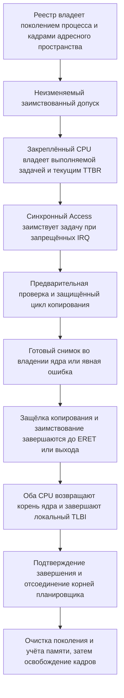

# Безопасное копирование данных пользователя

Document status: CURRENT
Evidence scope: ограниченное синхронное копирование в память и из памяти текущего процесса Phase 3.2 на двух CPU с фиксированной привязкой; задача #22.
Current reference: [ADR-0018](../architecture-decisions/0018-safe-user-copy.md)

<a name="kolvrt-memory-user-copy"></a>

## Границы функции

Каноническая запись описывает ограниченную реализацию. Доказательства ограничены входными данными записи; аппаратная проверка и готовность к эксплуатации являются отдельными этапами.

<a name="kolvrt-memory-user-copy-api"></a>

## API и ограничения

[Access и Snapshot](../../../../crates/kernel/src/user_copy.rs) образуют нативную границу доступа к памяти. Планировщик устанавливает, какая задача выполняется, и создаёт `Access`, который заимствует её на время копирования и не реализует `Send`/`Sync`. Указатель пользователя не превращается в ссылку Rust. [Модель допустимых диапазонов](../../../../crates/kernel-core/src/user_copy.rs) проверяет арифметику на переполнение.

```rust
access.copy_from_user::<CAPACITY>(address, length) -> Result<Snapshot<CAPACITY>, Error>
snapshot.bytes() -> &[u8]
access.copy_to_user(address, initialized_bytes) -> Result<(), Error>
```

За один вызов копируется не более 12 288 байт. Ёмкость снимка задаёт вызывающий код; она проверяется относительно этого предела, а данные размещаются в заранее инициализированном буфере стека ядра фиксированного размера. Переданная пользователем длина не приводит к выделению памяти. Вызывающий код должен задавать предел конкретного запроса, а не использовать глобальный максимум без необходимости. Тесты DEV выявили чрезмерное расходование стека при одновременном хранении нескольких максимальных снимков; в тестовом образе такие снимки размещены в отдельных функциях. Размер постоянного стека EL1 — 256 КиБ. Это ограниченный контракт реализации, а не стабильный публичный ABI системных вызовов.

Каждый диапазон должен целиком находиться в текущем пользовательском окне размером 2 МиБ, начинающемся с `USER_BASE`. Нулевой адрес, адреса ядра и переполнение при вычислении конца диапазона отклоняются. Для непустого диапазона каждая затронутая страница должна разрешать чтение или запись из EL0 — в зависимости от операции. Копирование байтов допускает невыровненные адреса. Для пустой операции всё равно проверяются идентичность процесса и ненулевой адрес внутри окна, но страница не читается и не записывается; поэтому отображение адреса при пустом копировании не требуется. Сначала проверяются ёмкость снимка и общий предел, затем диапазон, потом права страниц. Устаревший контекст выполнения отклоняется до доступа к памяти.

Строковые данные передаются как массив байтов с явной длиной и тем же ограничением размера. Неограниченного поиска нулевого байта и неявного преобразования в строку нет. После копирования получатель отдельно проверяет UTF-8 или другую требуемую кодировку. Запросы разбираются из байтов; этот API не преобразует внутренние структуры и перечисления Rust, их заполнители или поля размером с указатель в формат передачи. Для будущего формата сообщений нужно явно определить ширину полей, порядок байтов, версии и инициализацию резервных байтов согласно `LAW-018`.

<a name="kolvrt-memory-user-copy-faults"></a>

## Отказы и частичное копирование

| Результат                 | Значение                                                                                                                      |
| ------------------------- | ----------------------------------------------------------------------------------------------------------------------------- |
| `Success`                 | Скопированы все запрошенные байты; входные данные доступны только через готовый снимок                                        |
| `TooLarge`                | Длина превышает ёмкость снимка или общий предел реализации                                                                    |
| `InvalidRange`            | Нулевой адрес, переполнение, адрес ядра или выход за пользовательское окно                                                    |
| `PermissionDenied`        | Аппаратная предварительная проверка прав EL0 запретила операцию                                                               |
| `UserFault { copied: 0 }` | Предварительная проверка страницы завершилась отказом; байты назначения не изменены                                           |
| `UserFault { copied: n }` | Восстановленный отказ произошёл на точной инструкции копирования после записи `n` байтов                                      |
| `StaleContext`            | Не совпали CPU, корень таблиц, поколение очереди/процесса, состояние выполнения, владение или область исключительного доступа |

При ошибке чтения временный инициализированный буфер отбрасывается и снимок не публикуется, даже если низкоуровневое чтение успело скопировать часть данных. Буфера вызывающего кода, который мог бы остаться частично изменённым, здесь нет. Перед первой записью весь выходной диапазон проверяется предварительно. Если после этого возникает аппаратный отказ, часть байтов может быть уже записана; точное число таких байтов возвращается вместе с ошибкой. Запись в пользовательскую память не атомарна: вызывающий код не должен считать частичный результат успехом или полагать, что внешнее действие можно отменить. Инициализированные массивы байтов исключают передачу заполнителей и неинициализированных данных; полномочия и проверка кодировки остаются обязанностью вызывающего кода.

[Циклы копирования AArch64](../../../../crates/kernel/src/arch/aarch64/entry.S) используют `LDTRB`/`STTRB` для доступа к пользовательским байтам и тем самым соблюдают права EL0 даже при исполнении кода в EL1. Доступ ядра к собственной памяти выполняется обычными инструкциями; неожиданный отказ остаётся фатальным нарушением инварианта. [Предварительная проверка `AT S1E0R/W`](../../../../crates/kernel/src/arch/aarch64/mod.rs) проверяет каждую страницу без чтения её содержимого. Синхронный обработчик восстанавливается только после отказа чтения, доступа или прав на двух точных адресах инструкций копирования, если активна защёлка копирования данного CPU, `FAR` действителен и входит в запрошенный диапазон, а признак чтения/записи совпадает с операцией. Отказы выборки инструкций, внешние отказы, недействительный `FAR`, другой адрес инструкции и любые несвязанные исключения текущего уровня остаются фатальными. Общая таблица восстановления исключений и произвольное восстановление после ошибок ядра не вводятся.

<a name="kolvrt-memory-user-copy-snapshot"></a>

## Снимок и допуск операции

```text
изменяемые байты в EL0
  -> ограниченное копирование в закрытый инициализированный буфер ядра
  -> готовый неизменяемый Snapshot
  -> разбор и проверка всех полей
  -> проверка полномочий по тому же снимку
  -> допуск операции
  -> выполнение
```

Успешное копирование подтверждает допустимость доступа к памяти, но не полномочия на операцию. Получатель должен использовать один и тот же снимок для разбора, проверки и авторизации. Повторное чтение изменяемых полей EL0 после допуска вернуло бы гонку между проверкой и использованием. Тестовая задача EL0 передаёт значение `LE64` 42, возвращается в EL0, заменяет его на 43 и затем проверяет, что допущенное ядром значение осталось равным 42. Отдельный контроль, который намеренно перечитывает живое поле, обязан завершиться ошибкой. Дескрипторы, полномочия, домены, IPC и побочные эффекты допуска в этом этапе не реализованы.

<a name="kolvrt-memory-user-copy-lifetime"></a>

## Время жизни, SMP и публикация отображений



Проверка текущего пространства сверяет учёт удерживаемой памяти, точное поколение процесса, текущий `TTBR`, закреплённого владельца исполнения, поколение очереди, связанную задачу в состоянии `Running`, запрещённые IRQ и активную исключительную область планировщика. Поколение пространства публикуется после создания закрытых отображений и до допуска в очередь. Во время синхронного `dispatch` реестр остаётся изменяемо заимствованным, владеет кадрами без `Send`/`Sync` и не может освободить их или начать новый цикл допуска. Токен копирования не переживает заимствованную задачу планировщика и не переносится между CPU. Область копирования завершается до возврата в EL0, ожидания завершения, выхода из задачи или смены корня. Во время копирования нет выделения памяти, обычных блокировок, вывода в UART и уступки управления.

У каждого закрытого процесса ровно один исполнитель; другой CPU работает в отдельном закрытом пространстве. Изменять или снимать пользовательские страницы, совместно отображать пользовательскую память, переносить процесс между CPU и выполнять асинхронный выход нельзя. Текущая модель владения и неизменяемые отображения исключают эти гонки; одной предварительной проверки прав для такой гарантии недостаточно. До добавления изменяемых или совместных отображений потребуется удержание отображения либо его закрепление на время доступа. Нулевая ASID и полная завершённая локальная инвалидация `TLBI` сохраняются. Копирование проверено на двух CPU с фиксированной привязкой; произвольное число CPU, слабая модель памяти реального оборудования, вмешательство DMA и побочные каналы не проверялись.

<a name="kolvrt-memory-user-copy-evidence"></a>

## Проверки и измерения

[Проверяющий тестовый образ EL0](../../../../crates/kernel/src/user_copy/testing.rs) охватывает копирование в обе стороны, невыровненные диапазоны и диапазоны через границу страниц, нулевые адреса, память ядра, неотображённые страницы, защитную страницу и чужое пространство, выход в страницу только для чтения, переполнение, пустые и максимальные диапазоны, превышение размера, завершённые/отсоединённые задачи и устаревшее поколение пространства. Тестовый внедрённый отказ намеренно пропускает предварительную проверку для четырёх допустимых байтов перед защитной страницей. Производственные циклы копирования восстанавливаются после настоящего отказа посреди чтения или записи и сохраняют нетронутый хвост входного буфера. Это проверка изоляции отказа, а не поддержка гонки со снятием отображения. Проверка выходных данных сверяет заранее инициализированные байты; оба процесса завершаются и возвращают исходное число кадров. Контроли жизненного цикла по-прежнему обязательны.

[Отчёт Phase 3.2 для точного снимка исходников](../../../../research/results/kernel-phase32.json) фиксирует 69 проверок в каждом профиле DEV и PROD и 57 отрицательных контролей на хосте. [Инвентаризация unsafe-кода Phase 3.2](../../../../research/results/kernel-phase32-unsafe-audit.json) описывает новые привилегированные обращения к таблицам и ассемблерные границы; это перечень для ревью, а не доказательство безопасности.

Тестовая точка входа и поля снимков для проверяющей задачи отсутствуют в обычных образах. Нативные зависимости остаются в `kernel` и `kernel-core`; маршрутизация и совместимость остаются в образе EL0. В DEV счётчики по CPU фиксируют попытки копирования, отказы предварительной проверки и восстановления, а также последнюю отклонённую область, причину и синдром; отчёт выдаётся только после безопасной остановки. PROD исключает эти необязательные сведения, сохраняя проверки, ассемблерный код и семантику отказа. Отдельного небезопасного быстрого пути для одного из профилей нет.

Для микропроверок выполняются четыре разогревающих итерации и сохраняются 32 необработанных измерения копирования на каждый размер и CPU: 8 байт, одна страница, три страницы и отказ предварительной проверки для неотображённого адреса. Исполнитель проверяет уникальность области и CPU, а также повторно вычисляет квантили. Во всех случаях выбрана ёмкость снимка 12 КиБ; успешное копирование инициализирует её, а предварительный отказ возвращается до инициализации. Измерение малого копирования не отражает стоимость запроса с ёмкостью восемь байт. Измерения в тиках таймера включают проверки, инициализацию снимка, копирование и возврат; подготовка тестовой точки и сериализация данных в интервал не входят. Ошибка измеряется на этапе предварительной проверки, а не как аппаратное прерывание. Наблюдения QEMU TCG служат основой для регрессионного сравнения; это не сравнение с Linux/macOS и не заявление о пропускной способности оборудования.

Измерения в тиках таймера (62,5 МГц), 32 наблюдения на ячейку:

| Input span         | DEV CPU0 median / p95 | DEV CPU1 median / p95 | PROD CPU0 median / p95 | PROD CPU1 median / p95 |
| ------------------ | --------------------- | --------------------- | ---------------------- | ---------------------- |
| 8 bytes            | 2687 / 2931           | 1537 / 1644           | 500 / 518              | 519 / 587              |
| 4096 bytes         | 3863 / 4143           | 2125 / 2388           | 1087 / 1194            | 1106 / 1118            |
| 12288 bytes        | 6244 / 6775           | 3456 / 3675           | 2350 / 2587            | 2294 / 2556            |
| Unmapped preflight | 369 / 381             | 262 / 269             | 31 / 112               | 32 / 50                |

[Физически изолированная native-only матрица](../../../../research/results/native-compat-removal-phase32.json) повторяет 69/57 при отсутствии трёх пакетов совместимости; сверены 56 неизменённых файлов native-кода и проверяющего инструмента. [Регрессия Phase 2 routing](../../../../research/results/routing-phase32-regression.json) сохраняет шесть конфигураций EL0, stripped boot и три отрицательных контроля.

<a name="kolvrt-memory-user-copy-limits"></a>

## Небезопасный код и дальнейшие этапы

[Инвариант `INV-USER-COPY`](unsafe.md) описывает владение, необходимость, отказы и проверки. Лексический перечень вырос с 98 мест в базовом commit до 106: четыре места production (проверка прав, extern-объявления и два вызова) и четыре места только для тестов (объявления/срез образа и два вызова с намеренным отказом). Небезопасное хранилище процессов и новый `Sync` не добавлены. `INV-USER-COPY-TEST` применяется только к ограниченному намеренному внедрению отказа. Лексический перечень сам по себе не доказывает безопасность.

Отдельно принятый [контракт дескрипторов](handles.md) использует ограниченные готовые неизменяемые снимки запросов, инициализированные выходные буферы, явную ошибку при частичной записи и удержание памяти по поколению процесса. Он определяет собственные правила идентичности, типа, прав, закрытия и передачи; общий отзыв и выдача полномочий остаются отдельными этапами. Успешное копирование не даёт полномочий и не разрешает последующие этапы.

[Английский оригинал](../../../../docs/kernel/user-copy.md)

Phase 3.7 выбирает обычную fixture настоящего копирования для snapshot/recovery coverage. Тест импортирует настоящие методы copy/recover, передаёт запрещённые ranges и несовпадающие PC/FAR/direction, проверяет реальный recovery частичного копирования через guard page, отсутствие выдачи частичного Snapshot и сохранение инициализации хвоста. Стабильность snapshot — положительный инвариант; устаревшая тестовая мутация verdict удалена. Прежний recovery feature ничего не менял и удалён; требование fatal marker от исправного suite было ошибкой runner. Названные выше исторические receipts сохраняют исторический scope и не являются current-source acceptance этой миграции.

<!-- knowledge -->

```json
{
  "schema_version": 1,
  "id": "doc.kolvrt.kernel.user-copy",
  "kind": "subsystem-contract",
  "summary": "Навигация по документу: Безопасное копирование данных пользователя. Доказательства имеют указанные границы.",
  "units": [
    {
      "id": "kolvrt.memory.user-copy",
      "anchor": "kolvrt-memory-user-copy",
      "kind": "feature",
      "summary": "Каноническая секция: Границы функции.",
      "depends_on": [
        "kolvrt.memory.user-copy.api",
        "kolvrt.memory.user-copy.faults",
        "kolvrt.memory.user-copy.snapshot",
        "kolvrt.memory.user-copy.lifetime",
        "kolvrt.memory.user-copy.limits",
        "kolvrt.process.identity",
        "kolvrt.process.reclamation",
        "law.018",
        "law.013"
      ],
      "feature": {
        "implementation": "BOUNDED_IMPLEMENTED",
        "implementation_scope": "Synchronous current-process copies over immutable mappings.",
        "sources": [
          "crates/kernel/src/user_copy.rs",
          "crates/kernel-core/src/user_copy.rs"
        ],
        "acceptance": ["research/results/kernel-phase32.json"],
        "issues": [22],
        "adrs": ["adr.0018"],
        "limitations": [
          "No asynchronous copy, shared mutable mappings or public pointer ABI."
        ],
        "next_gate": "Re-derive lifetime/exclusion before mutable mappings or asynchronous use.",
        "verification": [
          {
            "environment": "qemu-arm64",
            "state": "STALE",
            "reason": "This feature retains historical receipts from before the Phase 3.7 source changes; its verification remains STALE pending a feature-scoped current-source review. The separately accepted bounded native-application fault/restart/shutdown evidence is recorded in docs/kernel/native-applications.md and research/results/native-phase37-43af402.json; it does not automatically renew this feature verification.",
            "scope": "The exact source digests, DEV/PROD and QEMU TCG configuration recorded by this receipt; physical ARM64 excluded.",
            "receipt": "research/results/kernel-phase32.json",
            "receipt_sha256": "6cb605f9ebde34d2af4d0608014911bbcd310336e4540cd829b2d219862a723e"
          },
          {
            "environment": "physical-arm64",
            "state": "UNKNOWN",
            "reason": "No physical ARM64 acceptance is established."
          }
        ],
        "readiness": "NOT_READY",
        "roadmap_gate": "Phase 3.2",
        "transitions": [
          {
            "from": "UNRECORDED",
            "to": "BOUNDED_IMPLEMENTED",
            "reason": "Initial reviewed catalog adoption of existing scoped contract; not a new implementation transition.",
            "acceptance": ["research/results/kernel-phase32.json"]
          }
        ]
      }
    },
    {
      "id": "kolvrt.memory.user-copy.api",
      "anchor": "kolvrt-memory-user-copy-api",
      "kind": "contract-section",
      "summary": "Каноническая секция: API и ограничения.",
      "depends_on": []
    },
    {
      "id": "kolvrt.memory.user-copy.faults",
      "anchor": "kolvrt-memory-user-copy-faults",
      "kind": "contract-section",
      "summary": "Каноническая секция: Отказы и частичное копирование.",
      "depends_on": []
    },
    {
      "id": "kolvrt.memory.user-copy.snapshot",
      "anchor": "kolvrt-memory-user-copy-snapshot",
      "kind": "contract-section",
      "summary": "Каноническая секция: Снимок и допуск операции.",
      "depends_on": []
    },
    {
      "id": "kolvrt.memory.user-copy.lifetime",
      "anchor": "kolvrt-memory-user-copy-lifetime",
      "kind": "contract-section",
      "summary": "Каноническая секция: Время жизни, SMP и публикация отображений.",
      "depends_on": []
    },
    {
      "id": "kolvrt.memory.user-copy.evidence",
      "anchor": "kolvrt-memory-user-copy-evidence",
      "kind": "contract-section",
      "summary": "Каноническая секция: Проверки и измерения.",
      "depends_on": []
    },
    {
      "id": "kolvrt.memory.user-copy.limits",
      "anchor": "kolvrt-memory-user-copy-limits",
      "kind": "contract-section",
      "summary": "Каноническая секция: Небезопасный код и дальнейшие этапы.",
      "depends_on": []
    }
  ]
}
```
